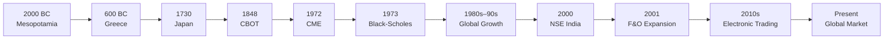

# History of Derivatives

> **Module:** Derivatives Basics  
> **Chapter:** 02 - History of Derivatives  
> **Level:** Beginner

---

# Learning Objectives

After completing this chapter, you will be able to:

- Understand the origin of derivatives.
- Explain why derivatives were developed.
- Trace the evolution of derivative markets.
- Learn the history of derivatives in India.
- Identify important milestones in modern derivatives trading.

---

# Introduction

Although derivatives seem like modern financial products, their history dates back **thousands of years**.

People have always faced uncertainty regarding prices of crops, metals, currencies, and other goods. To reduce this uncertainty, buyers and sellers began making agreements to trade goods at predetermined prices in the future.

These agreements became the foundation of today's derivative markets.

---

# Why Did Derivatives Originate?

In ancient economies, prices changed frequently because of:

- Weather conditions
- Wars
- Poor harvests
- Transportation problems
- Political instability
- Supply shortages

These price fluctuations created uncertainty for both buyers and sellers.

Example:

A farmer planting wheat today does not know what the market price will be after harvest.

Similarly, a merchant purchasing wheat several months later cannot predict future prices.

To reduce this uncertainty, both parties agreed on a price in advance.

This agreement became an early form of a derivative contract.

---
## Evolution of Derivatives



### Timeline Details

| Year | Event | Significance |
|------|-------|--------------|
| **2000 BC** | Ancient Mesopotamia | Early forward agreements between merchants and farmers to lock future prices. |
| **600 BC** | Ancient Greece | Contracts used in olive oil, grain, and wine trading. |
| **1730** | Dojima Rice Exchange (Japan) | One of the first organized futures exchanges. |
| **1848** | Chicago Board of Trade (CBOT) | Standardized futures contracts and centralized trading. |
| **1972** | Chicago Mercantile Exchange (CME) | Introduced financial futures, including currency futures. |
| **1973** | Black–Scholes Model | Mathematical model that transformed option pricing. |
| **1980s–1990s** | Global Expansion | Growth of equity, currency, interest rate, and commodity derivatives. |
| **2000** | NSE India | Nifty Index Futures launched in India. |
| **2001** | F&O Expansion | Index Options, Stock Options, and Stock Futures introduced. |
| **2010s** | Electronic Trading | Algorithmic and high-frequency trading became common. |
| **Present** | Modern Derivatives Market | Trillions of dollars traded daily across global exchanges. |
---

# Ancient Mesopotamia (Around 2000 BC)

The earliest known derivative-like contracts were found in Mesopotamia.

Merchants agreed to:

- Deliver goods later.
- Fix prices in advance.
- Reduce uncertainty in trade.

Although these contracts were informal, they shared many characteristics with modern forward contracts.

---

# Ancient Greece

Greek merchants used contracts to secure the future purchase of:

- Olive oil
- Grain
- Wine

These agreements protected traders against unexpected price movements.

One famous example involves the philosopher **Thales of Miletus**, who reserved olive presses before the harvest, anticipating high demand. While not a standardized derivative, it illustrates the economic idea of securing future rights based on expected market conditions.

---

# Rice Futures in Japan (17th Century)

One of the first organized futures markets developed in Japan.

Rice was the country's primary commodity and even served as a form of wealth.

Merchants began trading contracts that promised future delivery of rice at predetermined prices.

The **Dojima Rice Exchange** in Osaka, established in the 18th century, became one of the world's earliest organized futures exchanges.

---

# Chicago Board of Trade (1848)

The rapid growth of agriculture in the United States created significant price volatility.

Farmers needed price certainty before harvesting crops.

The **Chicago Board of Trade (CBOT)** was established in **1848** to provide a regulated marketplace for standardized forward and later futures contracts.

This marked the beginning of modern organized futures trading.

---

# Standardization of Futures

Earlier agreements were customized.

Problems included:

- Different contract sizes
- Different delivery dates
- Credit risk
- Lack of transparency

Exchanges solved these issues by introducing standardized contracts with fixed:

- Quantity
- Quality
- Expiry dates
- Settlement rules

Standardization greatly improved market efficiency and liquidity.

---

# Financial Derivatives (1970s)

Originally, derivatives focused mainly on commodities.

During the 1970s, financial markets expanded rapidly.

New derivative products were introduced for:

- Stocks
- Bonds
- Interest rates
- Stock indices
- Foreign exchange

Financial derivatives eventually became larger than commodity derivatives in terms of trading volume.

---

# Black-Scholes Revolution (1973)

In 1973, economists:

- Fischer Black
- Myron Scholes
- Robert Merton

developed a mathematical framework for pricing options, known as the **Black–Scholes Model**.

This model transformed option trading by providing a systematic method for estimating fair option values.

It remains one of the most influential developments in financial economics.

---

# Growth of Electronic Trading

Before computers, traders met physically on exchange floors using open outcry.

```text
Traditional Trading
        │
        ▼
Open Outcry
        │
        ▼
Electronic Trading
        │
        ▼
Algorithmic Trading
        │
        ▼
High Frequency Trading
```

Modern derivatives trading now occurs primarily through electronic platforms, enabling faster execution and broader market participation.

---

# History of Derivatives in India

## Before 2000

India had informal forward trading in several commodities.

However:

- Markets lacked standardization.
- Regulations were limited.
- Organized financial derivatives were absent.

---

## 2000: Introduction of Exchange-Traded Derivatives

The **National Stock Exchange (NSE)** introduced index futures in June 2000.

This marked the beginning of India's modern derivatives market.

---

## Major Milestones in India

| Year | Event |
|------|-------|
| 2000 | Index Futures Introduced |
| 2001 | Index Options |
| 2001 | Stock Options |
| 2001 | Stock Futures |
| Later Years | Currency Derivatives |
| Later Years | Interest Rate Derivatives |
| Later Years | Commodity Derivatives Expansion |

---

# Role of SEBI

The Securities and Exchange Board of India (SEBI) regulates India's securities and derivatives markets.

Its objectives include:

- Investor protection
- Market transparency
- Fair trading practices
- Risk management
- Market stability

---

# Major Indian Derivatives Exchanges

| Exchange | Products |
|----------|----------|
| NSE | Equity, Index, Currency Derivatives |
| BSE | Equity and Index Derivatives |
| MCX | Commodity Derivatives |
| NCDEX | Agricultural Commodity Derivatives |

---

# Global Derivatives Exchanges

Some of the world's largest derivatives exchanges include:

| Exchange | Country |
|----------|----------|
| CME Group | USA |
| ICE | USA |
| Eurex | Germany |
| London Metal Exchange (LME) | UK |
| Osaka Exchange | Japan |
| Singapore Exchange (SGX) | Singapore |

---

# Modern Derivatives Market

Today's derivatives markets trade contracts on:

- Stocks
- Stock indices
- Commodities
- Currencies
- Interest rates
- Energy products
- Precious metals
- Agricultural commodities
- Cryptocurrencies (on selected regulated platforms)

Transactions occur electronically, often within milliseconds, with sophisticated risk management systems and clearing corporations reducing counterparty risk.

---

# Importance of Derivatives Today

Derivatives help market participants to:

- Manage financial risk.
- Discover market prices.
- Improve liquidity.
- Allocate capital efficiently.
- Protect businesses from adverse price movements.
- Support investment and trading strategies.

---

# Timeline Summary

```text
Ancient Mesopotamia
        │
        ▼
Ancient Greece
        │
        ▼
Japanese Rice Markets
        │
        ▼
Chicago Board of Trade (1848)
        │
        ▼
Financial Futures (1972)
        │
        ▼
Black-Scholes Model (1973)
        │
        ▼
Electronic Trading
        │
        ▼
Indian Derivatives Market (2000)
        │
        ▼
Modern Global Markets
```

---

# Key Terms

| Term | Meaning |
|------|---------|
| Forward Contract | Customized agreement for future trade |
| Futures Contract | Standardized exchange-traded agreement |
| Derivatives Exchange | Marketplace for trading derivative contracts |
| Clearing Corporation | Entity that guarantees settlement of exchange-traded contracts |
| Electronic Trading | Computer-based order execution system |
| SEBI | Regulator of India's securities market |

---

# Summary

- Derivatives have existed in various forms for thousands of years.
- Early contracts helped traders manage uncertainty in agricultural markets.
- Organized futures trading began with exchanges such as the Chicago Board of Trade.
- The 1970s introduced modern financial derivatives and option pricing models.
- India launched exchange-traded financial derivatives in 2000 through the NSE.
- Today, derivatives are essential tools for risk management, price discovery, and investment across global financial markets.

---

# Quick Revision

✔ Derivatives originated to reduce price uncertainty.

✔ Early derivative-like contracts appeared in ancient civilizations.

✔ Japan developed one of the first organized futures markets.

✔ CBOT (1848) standardized futures trading.

✔ Black–Scholes (1973) revolutionized option pricing.

✔ NSE introduced exchange-traded derivatives in India in 2000.

✔ SEBI regulates the Indian derivatives market.

---

# What's Next?

➡ **03_types_of_derivatives.md**

In the next chapter, you'll learn:

- Forward Contracts
- Futures Contracts
- Options Contracts
- Swaps
- Key differences between each derivative type