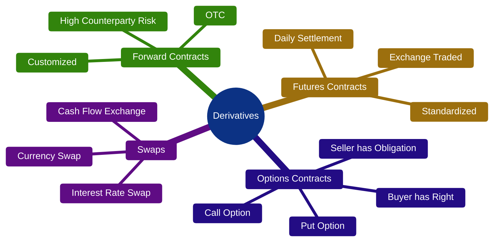
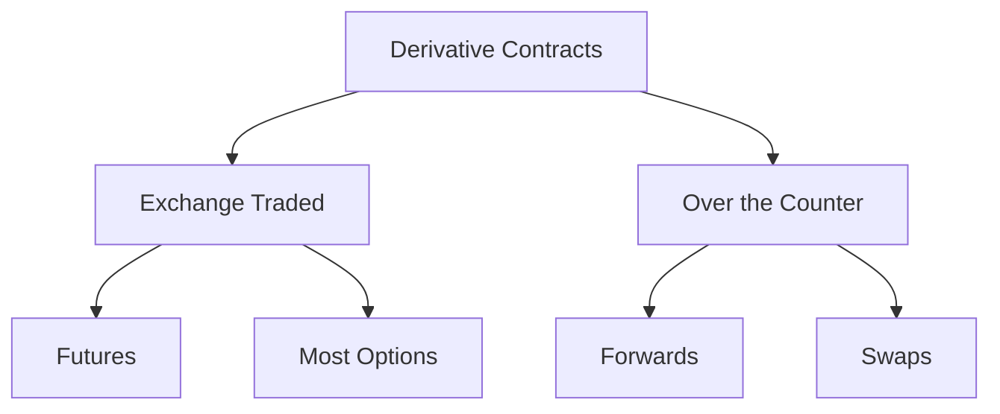

# Types of Derivatives

> **Module:** Derivatives Basics  
> **Chapter:** 03 - Types of Derivatives  
> **Level:** Beginner

---

# Learning Objectives

After completing this chapter, you will be able to:

- Understand the four major types of derivatives.
- Differentiate between Forward, Futures, Options, and Swaps.
- Identify where each derivative is traded.
- Understand their advantages and disadvantages.
- Select the appropriate derivative for different financial situations.

---

# Introduction

Derivatives are financial contracts whose value depends on an **underlying asset** such as:

- Stocks
- Stock Indices
- Commodities
- Currencies
- Bonds
- Interest Rates
- Cryptocurrencies

Although there are many derivative products available today, almost all of them originate from **four fundamental types of derivative contracts**.

---

# Classification of Derivatives



---

# Overview

| Type | Customized | Exchange Traded | Obligation | Risk Level |
|-------|------------|----------------|------------|------------|
| Forward | Yes | No | Yes | High |
| Futures | No | Yes | Yes | Medium |
| Options | Standardized | Usually Yes | Buyer: No<br>Seller: Yes | Medium |
| Swaps | Usually Customized | No | Yes | High |

---

# 1. Forward Contract

## Definition

A **Forward Contract** is a private agreement between two parties to buy or sell an asset at a predetermined price on a specified future date.

It is the oldest form of derivative.

---

## Characteristics

- Private agreement
- Customized contract
- Traded over-the-counter (OTC)
- No exchange involvement
- High counterparty risk
- No daily settlement

---

## Example

A wheat farmer expects to harvest wheat after three months.

A flour mill agrees today to buy wheat at **₹2,200 per quintal** after three months.

Regardless of future market prices:

- Farmer must sell.
- Flour mill must buy.

---

## Advantages

- Flexible
- Customized
- Suitable for businesses

---

## Disadvantages

- High default risk
- Low liquidity
- Difficult to transfer
- No clearing corporation

---

# 2. Futures Contract

## Definition

A **Futures Contract** is a standardized agreement to buy or sell an asset at a specified price on a future date through a regulated exchange.

Unlike forward contracts, futures are standardized.

---

## Characteristics

- Exchange traded
- Standardized
- Daily Mark-to-Market settlement
- Clearing corporation guarantees settlement
- High liquidity
- Margin required

---

## Example

You purchase one **Nifty Futures Contract**.

Current Index = 25,000

Contract expires after one month.

If Nifty rises,

Profit.

If Nifty falls,

Loss.

---

## Advantages

- Highly liquid
- Transparent
- Low counterparty risk
- Easy to exit before expiry

---

## Disadvantages

- Margin required
- Daily profit/loss adjustment
- Leverage increases risk

---

# 3. Options Contract

## Definition

An **Option** gives the buyer the **right, but not the obligation**, to buy or sell an asset at a predetermined price before or on the expiry date.

---

## Two Types

### Call Option

Right to BUY.

Used when expecting prices to rise.

---

### Put Option

Right to SELL.

Used when expecting prices to fall.

---

## Characteristics

- Buyer pays Premium.
- Limited loss for buyer.
- Unlimited or large risk for option seller (depending on the strategy).
- Flexible trading strategies.

---

## Example

Suppose Reliance trades at ₹2,500.

You purchase a Call Option with a strike price of ₹2,550.

If Reliance rises above ₹2,550,

your option becomes more valuable.

If the price remains below the strike price until expiry,

your maximum loss is generally limited to the premium paid.

---

## Advantages

- Limited loss for buyer
- High leverage
- Flexible strategies
- Income generation (for sellers under suitable strategies)

---

## Disadvantages

- Premium may expire worthless.
- Complex pricing.
- Time decay affects option value.

---

# 4. Swap Contract

## Definition

A **Swap** is an agreement between two parties to exchange future cash flows.

Swaps are mostly used by:

- Banks
- Corporations
- Financial Institutions

---

## Common Types

### Interest Rate Swap

Exchange:

Fixed Interest

↓

Floating Interest

---

### Currency Swap

Exchange:

Currency A

↓

Currency B

---

## Characteristics

- OTC contracts
- Highly customized
- Long-term agreements
- Used mainly for risk management

---

## Advantages

- Reduces financing cost
- Manages interest rate risk
- Manages currency risk

---

## Disadvantages

- Complex
- Counterparty risk
- Limited liquidity

---

# Comparison of All Four Types

| Feature | Forward | Futures | Options | Swaps |
|----------|----------|----------|----------|--------|
| Exchange Traded | No | Yes | Mostly Yes | No |
| Customized | Yes | No | Mostly No | Yes |
| Standardized | No | Yes | Yes | No |
| Daily Settlement | No | Yes | Yes | No |
| Margin Required | Usually No | Yes | Seller Usually | Depends |
| Counterparty Risk | High | Very Low | Low | High |
| Obligation | Yes | Yes | Buyer No | Yes |

---

# Where are They Used?

| Derivative | Common Users |
|------------|-------------|
| Forward | Exporters, Importers |
| Futures | Traders, Investors, Hedgers |
| Options | Traders, Investors, Portfolio Managers |
| Swaps | Banks, Corporations, Governments |

---

# Trading Venues



---

# Practical Examples

| Situation | Suitable Derivative |
|-----------|--------------------|
| Farmer wants fixed crop price | Forward |
| Trader expects Nifty to rise | Futures |
| Investor wants limited risk | Options |
| Company wants fixed interest payments | Interest Rate Swap |
| Exporter wants exchange rate protection | Currency Forward |

---

# Advantages of Different Types

| Contract | Best For |
|-----------|----------|
| Forward | Customized business agreements |
| Futures | Active trading |
| Options | Limited-risk trading |
| Swaps | Long-term risk management |

---

# Which Derivative Should You Choose?

```text
Need Customized Contract?
        │
   ┌────┴────┐
   │         │
 Yes        No
   │         │
Forward   Exchange Traded?
              │
        ┌─────┴─────┐
        │           │
      Yes          No
        │           │
 Futures/Options   Swaps
```

---

# Key Terms

| Term | Meaning |
|------|---------|
| Forward | Customized OTC agreement |
| Futures | Standardized exchange-traded agreement |
| Options | Right without obligation for the buyer |
| Swaps | Exchange of future cash flows |
| Premium | Price paid for an option |
| Margin | Security deposit for futures trading |
| OTC | Over-the-Counter market |

---

# Summary

- Derivatives are classified into four major categories:
  1. Forward Contracts
  2. Futures Contracts
  3. Options Contracts
  4. Swaps
- Forward and Swaps are generally traded over-the-counter (OTC).
- Futures and most Options are traded on organized exchanges.
- Futures and Forwards create obligations for both parties.
- Options give the buyer a right but not an obligation.
- Swaps are mainly used by institutions to manage long-term financial risks.

---

# Quick Revision

✔ Four types of derivatives.

✔ Forward → Customized OTC contract.

✔ Futures → Standardized exchange-traded contract.

✔ Options → Right without obligation for the buyer.

✔ Swaps → Exchange of future cash flows.

✔ Futures reduce counterparty risk through clearing corporations.

✔ Options require the buyer to pay a premium.

✔ Swaps are widely used by banks and corporations.

---

# What's Next?

➡ **04_market_participants.md**

In the next chapter, you'll learn:

- Who participates in derivative markets.
- Hedgers, Speculators, Arbitrageurs, and Market Makers.
- How each participant contributes to market efficiency.
```