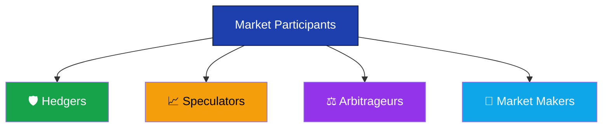
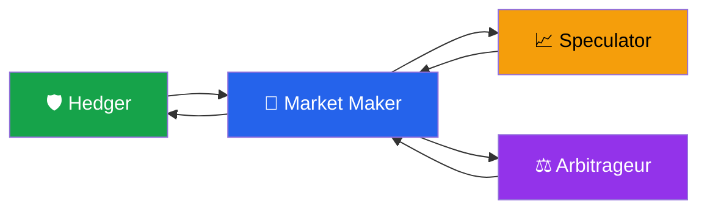

# Market Participants in Derivatives

> **Module:** Derivatives Basics  
> **Chapter:** 04 - Market Participants  
> **Level:** Beginner

---

# Learning Objectives

After completing this chapter, you will be able to:

- Understand who participates in derivative markets.
- Explain the role of each participant.
- Differentiate between hedgers, speculators, arbitrageurs, and market makers.
- Understand how these participants contribute to market efficiency.
- Identify real-world examples of each participant.

---

# Introduction

A derivatives market cannot function without participants. Every trade requires at least one buyer and one seller.

Different participants enter the market with different objectives. Some seek to **reduce risk**, others aim to **earn profits**, while some ensure that the market remains **liquid and efficient**.

---

# Classification of Market Participants



---

# Overview

| Participant | Primary Objective | Risk Level |
|-------------|-------------------|------------|
| Hedger | Reduce Risk | Low |
| Speculator | Earn Profit | High |
| Arbitrageur | Profit from Price Differences | Low |
| Market Maker | Provide Liquidity | Medium |

---

# 1. Hedgers

## Definition

A **hedger** uses derivatives to **reduce or eliminate the risk** of adverse price movements.

Instead of trying to make profits from price changes, hedgers aim to **protect their existing business or investments**.

---

## Why Hedging?

Businesses often face uncertainty due to changing prices.

Examples:

- Rising fuel prices
- Falling crop prices
- Currency fluctuations
- Interest rate changes

Derivatives help lock prices in advance.

---

## Example 1 – Farmer

A wheat farmer expects to harvest wheat after three months.

Current Market Price:

₹2,200 per quintal

The farmer fears prices may fall.

He sells Wheat Futures today.

If prices decline,

Loss in the physical market is largely offset by gains in the futures market.

---

## Example 2 – Airline

Airlines consume large amounts of aviation fuel.

Fuel prices may increase significantly.

The airline purchases crude oil futures.

If oil prices rise,

Higher fuel costs are offset by profits on the futures contracts.

---

## Advantages

- Reduces uncertainty
- Protects profits
- Stabilizes cash flows
- Simplifies business planning

---

## Disadvantages

- Limits gains if prices move favorably
- Hedging is not free (transaction costs, margin, premiums)

---

# 2. Speculators

## Definition

A **speculator** takes on risk intentionally in the hope of earning profits from future price movements.

Unlike hedgers, speculators do **not** own the underlying asset for business purposes.

---

## Example

Current Nifty:

25,000

A trader believes the market will rise.

He buys Nifty Futures.

If Nifty rises,

Profit.

If Nifty falls,

Loss.

---

## Why Speculators are Important

Speculators:

- Increase market liquidity
- Improve price discovery
- Make it easier for hedgers to find counterparties

Without speculators, hedgers would struggle to execute trades efficiently.

---

## Advantages

- Potential for high returns
- Improves market liquidity
- Supports efficient price discovery

---

## Risks

- High leverage
- Large losses possible
- Emotional trading
- Market volatility

---

# 3. Arbitrageurs

## Definition

An **arbitrageur** earns profit by exploiting **price differences** for the same asset in different markets.

These opportunities are usually short-lived.

---

## Example

Reliance shares trade at:

- NSE: ₹2,500
- BSE: ₹2,504

The arbitrageur:

- Buys on NSE
- Sells on BSE

Profit:

₹4 per share (before costs).

---

## Futures Arbitrage

Suppose:

Spot Price:

₹1,000

Fair Futures Price:

₹1,015

Actual Futures Price:

₹1,040

An arbitrageur can:

- Buy the asset in the spot market
- Sell the futures contract

When prices converge at expiry, the arbitrageur earns a relatively low-risk profit after accounting for carrying costs and transaction expenses.

---

## Importance

Arbitrage helps:

- Keep prices aligned
- Improve market efficiency
- Reduce pricing errors

---

# 4. Market Makers

## Definition

A **market maker** continuously provides both **buy (bid)** and **sell (ask)** prices.

Their objective is to ensure that investors can trade whenever they wish.

---

## Example

A market maker quotes:

Buy:

₹100

Sell:

₹100.20

The difference:

₹0.20

is called the **Bid-Ask Spread**.

---

## Functions

- Provide liquidity
- Reduce waiting time
- Narrow bid-ask spreads
- Improve market efficiency

---

## Common Market Makers

- Investment Banks
- Brokerage Firms
- Financial Institutions

---

# How Participants Interact



---

# Real-World Examples

| Participant | Real Example |
|-------------|--------------|
| Hedger | Farmer selling wheat futures |
| Hedger | Airline buying fuel futures |
| Hedger | Exporter hedging USD/INR exchange rates |
| Speculator | Trader buying Nifty Futures |
| Speculator | Investor buying Call Options |
| Arbitrageur | Buying on NSE and selling on BSE |
| Market Maker | Brokerage providing continuous bid and ask quotes |

---

# Comparison

| Feature | Hedger | Speculator | Arbitrageur | Market Maker |
|---------|---------|------------|-------------|--------------|
| Main Goal | Reduce Risk | Earn Profit | Price Difference | Provide Liquidity |
| Takes Risk? | Low | High | Low | Moderate |
| Owns Underlying? | Usually Yes | Usually No | Sometimes | No |
| Uses Leverage | Sometimes | Frequently | Occasionally | Yes |
| Market Impact | Stability | Liquidity | Price Efficiency | Liquidity |

---

# Why All Participants Are Necessary

```text
Hedgers
    │
Reduce Risk
    │
    ▼
Speculators
    │
Accept Risk
    │
    ▼
Arbitrageurs
    │
Correct Price Differences
    │
    ▼
Market Makers
    │
Provide Continuous Liquidity
    │
    ▼
Efficient Derivatives Market
```

---

# Advantages to the Market

| Participant | Contribution |
|-------------|--------------|
| Hedgers | Risk Transfer |
| Speculators | Liquidity & Price Discovery |
| Arbitrageurs | Price Efficiency |
| Market Makers | Continuous Trading |

---

# Key Terms

| Term | Meaning |
|------|---------|
| Hedging | Reducing financial risk using derivatives |
| Speculation | Taking risk to earn profit |
| Arbitrage | Buying and selling the same asset to profit from price differences |
| Market Maker | Institution that continuously quotes buy and sell prices |
| Bid Price | Highest price a buyer is willing to pay |
| Ask Price | Lowest price a seller is willing to accept |
| Spread | Difference between bid and ask prices |

---

# Summary

- Derivatives markets consist of four primary participants:
  1. Hedgers
  2. Speculators
  3. Arbitrageurs
  4. Market Makers
- Hedgers transfer risk, speculators assume risk, arbitrageurs eliminate pricing inefficiencies, and market makers provide liquidity.
- Each participant performs a distinct function that contributes to a stable, efficient, and liquid derivatives market.

---

# Quick Revision

✔ **Hedger** → Protects against risk.

✔ **Speculator** → Seeks profit from price movements.

✔ **Arbitrageur** → Exploits price differences across markets.

✔ **Market Maker** → Provides continuous buy and sell quotes.

✔ Together, these participants ensure that derivatives markets remain efficient, liquid, and well-functioning.

---

# What's Next?

➡ **05_uses_of_derivatives.md**

In the next chapter, you'll learn:

- Why derivatives are used.
- Hedging, speculation, arbitrage, and portfolio management.
- Practical applications in business and investing.