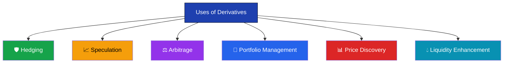
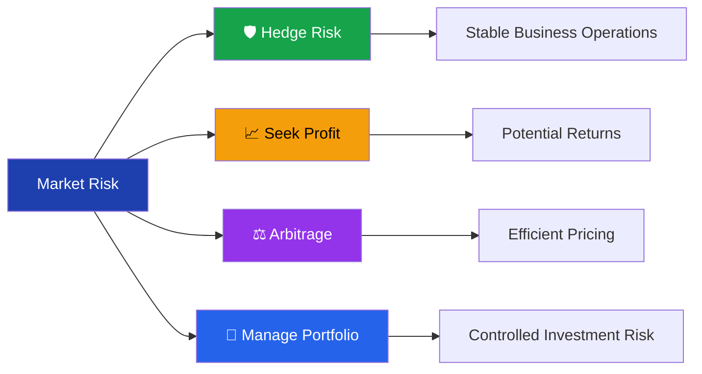

# Uses of Derivatives

> **Module:** Derivatives Basics  
> **Chapter:** 05 - Uses of Derivatives  
> **Level:** Beginner

---

# Learning Objectives

After completing this chapter, you will be able to:

- Understand why derivatives are used.
- Explain the major applications of derivatives.
- Differentiate between hedging, speculation, arbitrage, and portfolio management.
- Identify real-world examples of derivative usage.
- Recognize both the benefits and risks associated with derivatives.

---

# Introduction

Derivatives were originally developed as **risk management tools**. Over time, they have evolved into essential financial instruments used by businesses, investors, financial institutions, and governments.

Today, derivatives are used for:

- Managing risk
- Earning profits
- Improving market efficiency
- Portfolio management
- Price discovery
- Increasing market liquidity

---

# Major Uses of Derivatives

---

# 1. Hedging (Risk Management)

## What is Hedging?

**Hedging** is the process of reducing or protecting against the risk of unfavorable price movements.

It is the **primary purpose** for which derivatives were created.

---

## Why Hedge?

Businesses face many risks:

- Commodity price changes
- Currency fluctuations
- Interest rate movements
- Stock market volatility

Using derivatives, these risks can be reduced by locking in prices or exchange rates.

---

## Example: Farmer

A wheat farmer expects to harvest crops after three months.

Current wheat price:

₹2,200 per quintal

The farmer fears prices may decline.

He sells wheat futures today.

If wheat prices fall,

- Loss in the physical market
- Gain in the futures market

This reduces overall risk.

---

## Example: Importer

An Indian company must pay **USD 1 million** after two months.

If the rupee weakens against the US dollar, the payment becomes more expensive.

The company buys **USD/INR futures** to lock the exchange rate.

---

## Advantages of Hedging

- Reduces uncertainty
- Protects business profits
- Stabilizes cash flow
- Improves financial planning

---

# 2. Speculation

## What is Speculation?

Speculation involves taking calculated risks to earn profits from expected price movements.

Speculators willingly accept risk in anticipation of future gains.

---

## Example

Current Nifty Index:

25,000

A trader expects the market to rise.

He buys Nifty Futures.

If Nifty rises,

Profit.

If Nifty falls,

Loss.

---

## Why Speculators Matter

Speculators:

- Increase trading volume
- Improve liquidity
- Help in price discovery
- Make markets more efficient

---

## Risks

- High leverage
- Large losses
- Market volatility
- Emotional decision-making

---

# 3. Arbitrage

## What is Arbitrage?

Arbitrage is the process of earning profits from **price differences** for the same asset in different markets.

These opportunities are usually temporary.

---

## Example

ABC Ltd. shares trade at:

| Exchange | Price |
|----------|-------|
| NSE | ₹500 |
| BSE | ₹503 |

An arbitrageur:

- Buys at ₹500 on NSE.
- Sells at ₹503 on BSE.

Profit:

₹3 per share (before costs).

---

## Futures Arbitrage

Spot Price:

₹1,000

Fair Futures Price:

₹1,015

Market Futures Price:

₹1,035

An arbitrageur buys in the spot market and sells the futures contract, expecting prices to converge by expiry.

---

## Importance

Arbitrage:

- Eliminates pricing inefficiencies
- Keeps prices aligned
- Improves market efficiency

---

# 4. Portfolio Management

Institutional investors use derivatives to manage investment portfolios.

Objectives include:

- Protecting portfolio value
- Reducing market risk
- Balancing asset allocation
- Controlling volatility

---

## Example

A mutual fund owns shares worth ₹100 crore.

The fund manager expects a temporary market decline.

Instead of selling all stocks,

the manager sells **Nifty Futures** to hedge the portfolio.

If the market falls,

Losses in the stock portfolio are partially offset by gains in futures.

---

# 5. Price Discovery

## What is Price Discovery?

Price discovery is the process by which markets determine the fair value of an asset.

Derivative markets contribute because traders continuously incorporate:

- New information
- Economic data
- Company performance
- Market expectations

into prices.

---

## Example

Before a company's earnings announcement, option prices may indicate the market's expectation of future volatility.

---

# 6. Liquidity Enhancement

Liquidity refers to the ease with which assets can be bought or sold without significantly affecting their prices.

Derivatives increase liquidity by:

- Attracting more participants
- Increasing trading volume
- Allowing efficient risk transfer

Greater liquidity generally leads to narrower bid-ask spreads and more efficient markets.

---

# Other Uses of Derivatives

## Currency Risk Management

Exporters and importers hedge exchange rate fluctuations using currency derivatives.

---

## Interest Rate Risk Management

Banks and corporations use:

- Interest Rate Futures
- Interest Rate Swaps

to manage borrowing costs.

---

## Commodity Price Protection

Businesses dealing in:

- Gold
- Silver
- Crude Oil
- Agricultural Products

use commodity derivatives to stabilize input costs and revenues.

---

## Employee Compensation

Many companies grant **Employee Stock Options (ESOPs)** to align employee interests with company performance.

Although ESOPs differ from exchange-traded options, they are based on option principles.

---

# Real-Life Applications

| Industry | Derivative Used | Purpose |
|----------|-----------------|---------|
| Agriculture | Commodity Futures | Lock crop prices |
| Airlines | Crude Oil Futures | Hedge fuel costs |
| Exporters | Currency Futures | Manage exchange rate risk |
| Banks | Interest Rate Swaps | Hedge interest rate exposure |
| Mutual Funds | Index Futures | Portfolio hedging |
| Traders | Options & Futures | Profit from market movements |

---

# Flow of Derivative Usage

---

# Advantages of Using Derivatives

- Reduce financial risk
- Improve price discovery
- Increase market liquidity
- Protect investments
- Support portfolio management
- Enable efficient capital utilization
- Provide opportunities for profit

---

# Risks of Using Derivatives

- High leverage can amplify losses.
- Complex instruments require expertise.
- Market volatility may increase risk.
- Counterparty risk exists in OTC contracts.
- Improper use can lead to significant financial losses.

---

# Advantages vs Risks

| Advantages | Risks |
|------------|-------|
| Risk Management | Leverage Risk |
| Price Discovery | Market Volatility |
| Liquidity | Complexity |
| Portfolio Protection | Counterparty Risk |
| Efficient Capital Usage | Potential Large Losses |

---

# Key Terms

| Term | Meaning |
|------|---------|
| Hedging | Reducing exposure to financial risk |
| Speculation | Taking risk to earn profits |
| Arbitrage | Profiting from price differences |
| Portfolio Hedging | Protecting an investment portfolio |
| Price Discovery | Determining fair market prices |
| Liquidity | Ease of buying and selling assets |

---

# Summary

- Derivatives serve multiple purposes beyond risk management.
- The six major uses are:
  1. Hedging
  2. Speculation
  3. Arbitrage
  4. Portfolio Management
  5. Price Discovery
  6. Liquidity Enhancement
- Businesses use derivatives to stabilize costs and revenues.
- Investors use derivatives to manage portfolios and seek profits.
- Financial markets rely on derivatives to improve efficiency and liquidity.

---

# Quick Revision

✔ **Hedging** → Reduce risk.

✔ **Speculation** → Earn profits from price changes.

✔ **Arbitrage** → Profit from price differences.

✔ **Portfolio Management** → Protect investments.

✔ **Price Discovery** → Determine fair market prices.

✔ **Liquidity Enhancement** → Make trading easier and more efficient.

---

# What's Next?

➡ **06_advantages_and_risks.md**

In the next chapter, you'll explore:

- Advantages of derivatives
- Risks associated with derivative trading
- Best practices for responsible use of derivatives
- Common mistakes made by beginners