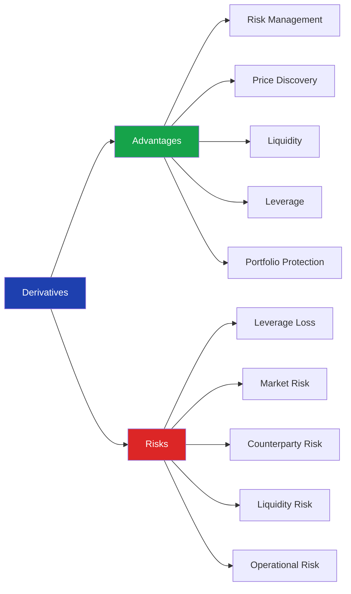
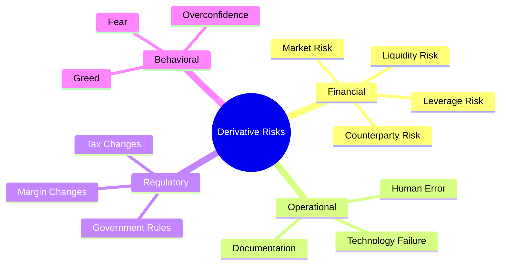
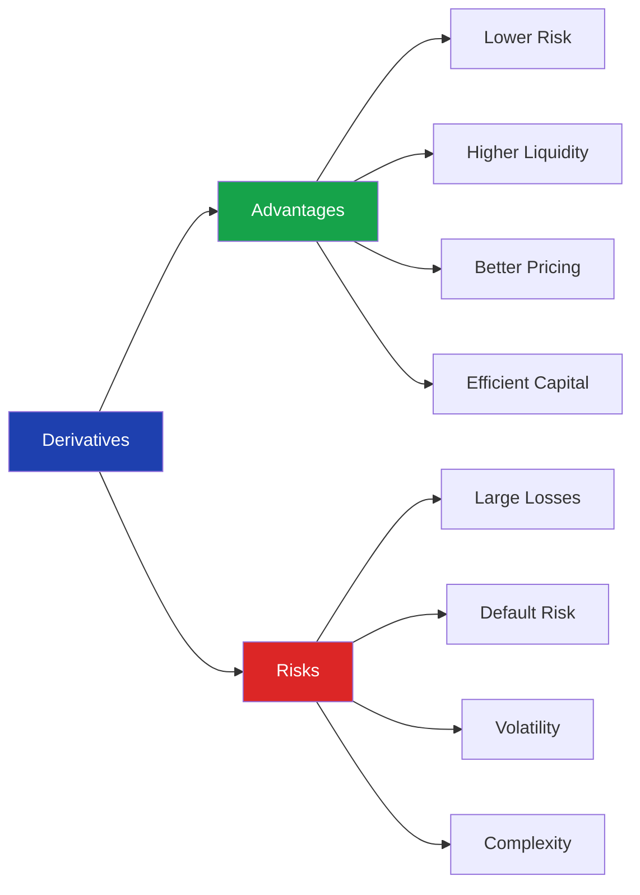

# Advantages and Risks of Derivatives

> **Module:** Derivatives Basics  
> **Chapter:** 06 – Advantages and Risks of Derivatives  
> **Level:** Beginner

---

# Learning Objectives

After completing this chapter, you will be able to:

- Explain the major advantages of derivatives.
- Understand the risks involved in derivative trading.
- Compare benefits and drawbacks.
- Identify best practices for using derivatives responsibly.
- Recognize real-world examples of successful and unsuccessful derivative usage.

---

# Introduction

Derivatives are among the most powerful financial instruments in modern financial markets. They help businesses manage uncertainty, investors protect portfolios, and traders seek profits.

However, derivatives are **double-edged swords**.

When used correctly, they reduce financial risk.

When misused, they can lead to enormous losses.

> **Key Idea**
>
> Derivatives themselves are **not risky**. Improper use, excessive leverage, and lack of understanding create the risks.

---

# Risk–Reward Overview



---

# Advantages of Derivatives

## 1. Risk Management (Hedging)

The primary purpose of derivatives is **risk reduction**.

Businesses can lock future prices to reduce uncertainty.

### Example

An airline expects fuel prices to rise.

It buys crude oil futures today.

If fuel prices increase,

- Fuel cost increases
- Futures contract generates profit

Overall fuel expense remains relatively stable.

### Benefits

- Stable profits
- Predictable cash flows
- Reduced uncertainty

---

## 2. Price Discovery

Derivative markets continuously incorporate:

- Demand
- Supply
- News
- Interest rates
- Inflation
- Economic expectations

This helps determine a fair market price.

### Example

Index futures often react before the stock market opens, indicating expected market direction.

---

## 3. Liquidity

Derivatives attract many market participants:

- Hedgers
- Speculators
- Arbitrageurs
- Institutions

More participants mean:

- Easier buying and selling
- Lower transaction costs
- Efficient markets

---

# 4. Leverage

Leverage allows traders to control a large contract value with a relatively small margin.

Example

Margin Required:

₹1,00,000

Contract Value:

₹10,00,000

Control Ratio:

10 : 1

### Benefits

- Efficient use of capital
- Higher potential returns
- Better capital allocation

### Caution

Leverage increases profits **and** losses.

---

# 5. Portfolio Protection

Investors use derivatives to reduce losses during market declines.

### Example

Portfolio Value:

₹50 lakh

Expected Market Fall:

10%

Investor sells Nifty Futures.

If the market falls,

Portfolio loses value.

Futures position gains value.

Net loss becomes much smaller.

---

# 6. Arbitrage Opportunities

Arbitrage keeps markets efficient.

Example

Gold Price

Spot Market:

₹60,000

Futures Market:

₹60,700

If the difference is excessive,

arbitrage traders buy in one market and sell in another until prices converge.

---

# 7. Better Financial Planning

Businesses can estimate future:

- Revenue
- Costs
- Cash flows

This improves budgeting and investment decisions.

---

# Summary of Advantages

| Advantage | Benefit |
|------------|----------|
| Hedging | Reduces financial risk |
| Price Discovery | Fair pricing |
| Liquidity | Easier trading |
| Leverage | Efficient capital use |
| Portfolio Protection | Reduces investment risk |
| Arbitrage | Market efficiency |
| Planning | Better business decisions |

---

# Risks of Derivatives

Although derivatives provide many benefits, they also involve significant risks.

---

# 1. Leverage Risk

Leverage magnifies gains and losses.

### Example

Investment:

₹1 lakh

Exposure:

₹10 lakh

Market falls:

10%

Loss:

₹1 lakh

Entire investment is wiped out.

---

# 2. Market Risk

Unexpected market movements can produce heavy losses.

Causes include:

- Economic slowdown
- Inflation
- Political instability
- Natural disasters
- Company news

---

# 3. Counterparty Risk

This risk mainly exists in **Over-the-Counter (OTC)** derivatives.

If one party fails to fulfill the contract,

the other party may suffer financial loss.

### Example

A company enters into a forward contract with another company.

If one company defaults,

the contract may not be honored.

---

# 4. Liquidity Risk

Some derivative contracts are difficult to buy or sell.

Low liquidity may cause:

- Wider bid-ask spreads
- Difficulty exiting positions
- Price slippage

---

# 5. Operational Risk

Losses may arise because of:

- Human errors
- Incorrect pricing
- Software failures
- System breakdowns
- Documentation mistakes

---

# 6. Regulatory Risk

Government regulations may change:

- Margin requirements
- Trading rules
- Taxation
- Position limits

These changes can affect profitability.

---

# 7. Complexity Risk

Some derivatives are highly complex.

Examples:

- Exotic Options
- Credit Default Swaps (CDS)
- Structured Products

These require advanced financial knowledge.

---

# 8. Psychological Risk

Many traders lose money because of:

- Greed
- Fear
- Overconfidence
- Revenge trading
- Lack of discipline

Emotional decisions often lead to poor outcomes.

---

# Risk Classification



---

# Real-World Examples

| Event | Lesson |
|--------|--------|
| Hedging by Airlines | Reduced fuel price volatility |
| Exporters using Currency Futures | Stable exchange rates |
| Long-Term Capital Management (1998) | Excessive leverage can be dangerous |
| Global Financial Crisis (2008) | Complex derivatives can increase systemic risk |

---

# Best Practices

✔ Understand the product before trading.

✔ Use derivatives for hedging whenever possible.

✔ Avoid excessive leverage.

✔ Diversify investments.

✔ Monitor positions regularly.

✔ Maintain adequate margin.

✔ Follow risk management rules.

✔ Never trade based on emotions.

---

# Advantages vs Risks

| Advantages | Risks |
|------------|-------|
| Risk Reduction | Market Risk |
| Higher Liquidity | Liquidity Risk |
| Efficient Capital Use | Leverage Risk |
| Portfolio Protection | Counterparty Risk |
| Price Discovery | Operational Risk |
| Better Planning | Regulatory Risk |

---

# Comparison



---

# Key Terms

| Term | Meaning |
|------|---------|
| Hedging | Reducing financial risk |
| Leverage | Controlling large value with small capital |
| Counterparty Risk | Risk that the other party defaults |
| Liquidity Risk | Difficulty buying or selling |
| Operational Risk | Loss due to internal failures |
| Market Risk | Loss from price fluctuations |

---

# Summary

- Derivatives provide powerful tools for managing financial risk.
- Their main advantages include hedging, liquidity, leverage, portfolio protection, and price discovery.
- The major risks include leverage risk, market risk, counterparty risk, liquidity risk, operational risk, and behavioral risk.
- Successful use of derivatives requires discipline, knowledge, and effective risk management.

---

# Quick Revision

| ✔ Advantages | ⚠ Risks |
|--------------|---------|
| Hedging | Leverage |
| Liquidity | Market Risk |
| Price Discovery | Counterparty Risk |
| Portfolio Protection | Liquidity Risk |
| Efficient Capital | Operational Risk |
| Better Planning | Behavioral Risk |

---

# Key Takeaway

> **Derivatives are powerful financial tools.**
>
> Used wisely, they reduce risk and improve financial efficiency.
>
> Used recklessly, they can magnify losses and threaten financial stability.

---

# What's Next?

➡ **07_derivative_markets_and_exchanges.md**

In the next chapter, you'll learn about:

- Exchange-traded vs OTC derivatives
- Major derivative exchanges
- Clearing corporations
- Margin systems
- Contract standardization
```