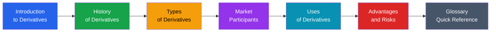
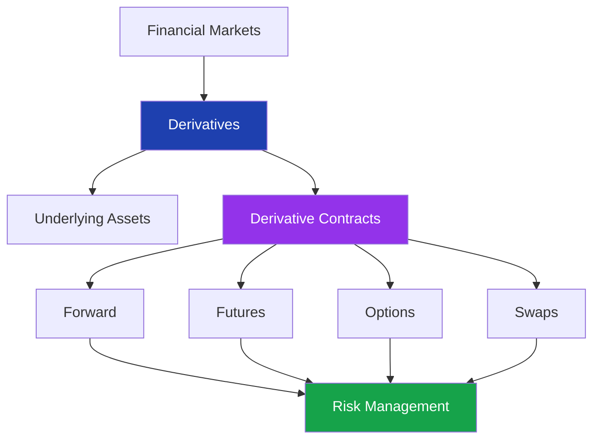

# Derivatives Basics

> **Module:** Futures & Options  
> **Level:** Beginner → Intermediate  
> **Purpose:** Foundation of derivative markets, instruments, participants, and applications.

---

# Module Overview

Derivatives are financial contracts whose value depends on an underlying asset.

This module introduces:

- Basic concepts of derivatives
- History and evolution
- Types of derivative contracts
- Market participants
- Uses of derivatives
- Advantages and risks
- Important terminology

---

# Learning Path



---

# Chapters

| No. | Chapter | Description |
|---|---|---|
| 01 | [Introduction to Derivatives](01_introduction_to_derivatives.md) | Meaning, concept, underlying assets, basic working |
| 02 | [History of Derivatives](02_history_of_derivatives.md) | Evolution from agriculture to modern markets |
| 03 | [Types of Derivatives](03_types_of_derivatives.md) | Forward, Futures, Options, Swaps |
| 04 | [Market Participants](04_market_participants.md) | Hedgers, Speculators, Arbitrageurs, Market Makers |
| 05 | [Uses of Derivatives](05_uses_of_derivatives.md) | Hedging, speculation, arbitrage, portfolio management |
| 06 | [Advantages and Risks](06_advantages_and_risks.md) | Benefits, limitations, and risks |
| 07 | [Glossary](glossary.md) | Important derivative terminology |

---

# Chapter Dependency



---

# Prerequisites

Before starting this module, basic knowledge of:

- Financial markets
- Stocks and commodities
- Buying and selling concepts
- Basic profit and loss calculations

is helpful.

---

# Skills You Will Gain

After completing this module, you will understand:

✅ What derivatives are

✅ Why derivatives exist

✅ How futures and options work

✅ Who participates in derivative markets

✅ How derivatives manage financial risk

✅ Benefits and dangers of derivative trading

---

# Module Files

```text
01_derivatives_basics/

├── index.md

├── 01_introduction_to_derivatives.md
├── 02_history_of_derivatives.md
├── 03_types_of_derivatives.md
├── 04_market_participants.md
├── 05_uses_of_derivatives.md
├── 06_advantages_and_risks.md

└── glossary.md
```

---

# Next Module

➡ **02_futures_basics**

Topics:

- Futures contract structure
- Contract specifications
- Margin system
- Settlement process
- Futures pricing