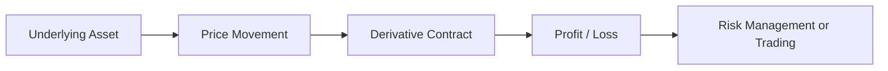

# Derivatives Basics - Practice Questions

> **Module:** Futures & Options  
> **Chapter:** Derivatives Basics  
> **Purpose:** Concept building, written practice, and exam preparation

---

# Section A: Conceptual Questions

## 1. Define a derivative.

Explain:

- Meaning of derivative
- Why it is called a derivative
- Role of underlying assets

---

## 2. Explain the relationship between a derivative and its underlying asset.

Include examples of:

- Stock derivatives
- Commodity derivatives
- Currency derivatives

---

## 3. Why were derivatives originally created?

Explain the role of derivatives in:

- Agriculture
- Business risk management
- Price protection

---

## 4. Explain the major characteristics of derivatives.

Discuss:

- Value derived from underlying asset
- Future settlement
- Contractual obligation
- Risk transfer

---

# Section B: Understanding Questions

---

## 5. Explain the difference between:

| Derivative | Underlying Asset |
|---|---|
| Futures contract | Gold |
| Option contract | Reliance stock |
| Currency future | USD/INR |

---

## 6. Explain the four major types of derivatives.

Write short notes on:

1. Forward Contracts
2. Futures Contracts
3. Options Contracts
4. Swaps

---

## 7. Compare Forward and Futures Contracts.

| Feature | Forward | Futures |
|-|-|-|
| Trading | | |
| Standardization | | |
| Regulation | | |
| Counterparty Risk | | |
| Settlement | | |

---

# Section C: Application-Based Questions

---

## 8. Farmer Hedging Case Study

A farmer expects to harvest wheat after three months.

Current wheat price:

₹2,500 per quintal

The farmer fears prices may fall.

Answer:

1. Which derivative should the farmer use?
2. Is the farmer hedging or speculating?
3. How does the derivative reduce risk?

---

## 9. Importer Currency Risk Case Study

An Indian company must pay:

USD 5 million after 6 months.

The company fears the rupee may weaken.

Answer:

1. What risk does the company face?
2. Which derivative can be used?
3. Explain how it protects the company.

---

## 10. Portfolio Protection Case Study

A mutual fund owns:

₹200 crore equity portfolio.

The manager expects temporary market decline.

Answer:

1. Should the manager sell all shares?
2. How can index futures help?
3. What happens if the market falls?

---

# Section D: Numerical Practice

---

## 11. Futures Profit Calculation

A trader buys Nifty Futures at:

Entry Price = 22,000

Exit Price = 22,500

Lot Size = 50

Calculate:

1. Profit per unit
2. Total profit

Formula:

```
Profit = (Selling Price - Buying Price) × Lot Size
```

---

## 12. Futures Loss Calculation

A trader buys Gold Futures at:

₹70,000

Later sells at:

₹68,500

Lot Size:

10 units

Calculate total loss.

---

## 13. Arbitrage Opportunity

A stock trades at:

| Exchange | Price |
|-|-:|
| NSE | ₹1,000 |
| BSE | ₹1,020 |

Answer:

1. Is arbitrage possible?
2. Explain the transaction.
3. Calculate gross profit per share.

---

# Section E: Analytical Questions

---

## 14. Explain the role of hedgers, speculators, and arbitrageurs in derivative markets.

Discuss how each participant contributes to market efficiency.

---

## 15. Why are derivatives considered both useful and risky?

Explain:

Benefits:

- Risk management
- Liquidity
- Price discovery

Risks:

- Leverage
- Market volatility
- Counterparty risk

---

# Section F: Compare and Explain

---

## 16. Exchange Traded vs OTC Derivatives

Complete the table:

| Feature | Exchange Traded | OTC |
|-|-|-|
| Standardization | | |
| Transparency | | |
| Regulation | | |
| Risk | | |
| Examples | | |

---

## 17. Hedging vs Speculation

| Hedging | Speculation |
|-|-|
| | |
| | |
| | |

---

# Section G: Long Answer Questions

---

## 18. Explain the complete working process of derivatives.

Include:



---

## 19. Explain the advantages and disadvantages of derivatives.

Cover:

### Advantages

- Risk transfer
- Market efficiency
- Liquidity
- Portfolio management

### Disadvantages

- Leverage risk
- Complexity
- Speculation risk

---

## 20. Explain the importance of derivatives in modern financial markets.

Discuss:

- Businesses
- Investors
- Banks
- Global markets

---

# Revision Checklist

Before moving to the next chapter, you should be able to answer:

✅ What is a derivative?

✅ What is an underlying asset?

✅ Difference between futures and forwards

✅ Purpose of options

✅ Uses of derivatives

✅ Role of market participants

✅ Risks involved in derivatives

---

# Next Practice Set

➡ Futures Contracts Practice Questions

Topics:

- Futures contract specifications
- Margin calculations
- Settlement mechanism
- Futures pricing