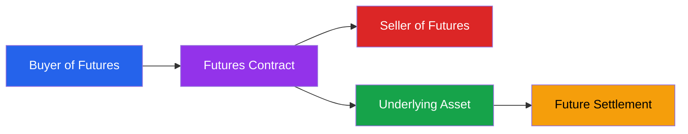
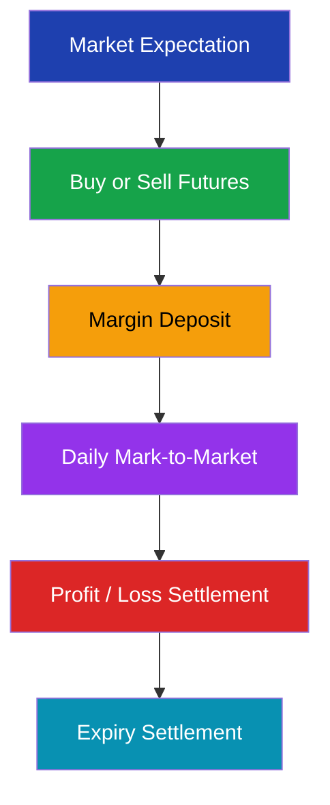

# Futures Basics

> **Module:** Futures & Options  
> **Chapter:** 01 - Futures Basics  
> **Level:** Beginner → Intermediate

---

# Learning Objectives

After completing this chapter, you will be able to:

- Understand what a futures contract is.
- Explain how futures markets work.
- Identify the key components of a futures contract.
- Understand buyer and seller obligations.
- Learn the role of margin and settlement.
- Differentiate futures from spot markets and forwards.

---

# Introduction

A **futures contract** is a standardized legal agreement between two parties to buy or sell an asset at a predetermined price on a specified future date.

Unlike a normal purchase, futures contracts are based on:

- Future price expectations
- Risk management
- Trading opportunities

Futures are one of the most important derivative instruments used in global financial markets.

---

# Simple Definition

> A futures contract is an exchange-traded agreement to buy or sell an underlying asset at a fixed price on a future date.

---

# Basic Structure of Futures



---

# Example of Futures Contract

Suppose:

Current Gold Price:

₹70,000 per 10 grams

A trader expects gold prices to rise.

The trader buys a Gold Futures contract at:

₹71,000

After one month:

### Scenario 1: Price Rises

Gold price = ₹75,000

Profit:

```
75,000 - 71,000 = ₹4,000
```

---

### Scenario 2: Price Falls

Gold price = ₹68,000

Loss:

```
68,000 - 71,000 = ₹3,000
```

---

# Important Elements of a Futures Contract

## 1. Underlying Asset

The asset on which the futures contract is based.

Examples:

| Futures Contract | Underlying |
|-|-|
| Nifty Futures | Nifty 50 Index |
| Gold Futures | Gold |
| Crude Oil Futures | Crude Oil |
| USDINR Futures | Currency |

---

## 2. Contract Size

The quantity covered by one futures contract.

Example:

Nifty Futures:

```
1 Lot = Fixed number of Nifty units
```

---

## 3. Futures Price

The agreed price for buying or selling the asset in the future.

---

## 4. Expiry Date

The date on which the futures contract ends.

Common expiry periods:

- Weekly
- Monthly
- Quarterly

---

## 5. Tick Size

The minimum price movement allowed in a futures contract.

Example:

Price movement:

```
₹1 → ₹2 → ₹3
```

---

# How Futures Work



---

# Futures Buyer and Seller

## Futures Buyer (Long Position)

A buyer expects:

- Price will increase
- Future purchase price will become cheaper

Profit when:

```
Market Price > Futures Price
```

---

## Futures Seller (Short Position)

A seller expects:

- Price will decrease

Profit when:

```
Market Price < Futures Price
```

---

# Long vs Short Position

| Position | Meaning | Expectation |
|-|-|-|
| Long Futures | Buy contract | Price will rise |
| Short Futures | Sell contract | Price will fall |

---

# Margin System

Futures trading does not require full payment.

Instead, traders deposit margin.

Types:

## Initial Margin

Amount required to open a position.

---

## Maintenance Margin

Minimum balance required to keep the position open.

---

# Mark-to-Market Settlement

Futures contracts are settled daily.

Every day:

- Profit is credited
- Loss is deducted

Example:

Buying futures at:

₹1,000

Closing price:

₹1,050

Profit:

₹50

The amount is adjusted daily.

---

# Futures Market Participants

| Participant | Purpose |
|-|-|
| Hedgers | Reduce price risk |
| Speculators | Earn profit |
| Arbitrageurs | Exploit price differences |
| Institutions | Portfolio management |

---

# Futures vs Spot Market

| Feature | Spot Market | Futures Market |
|-|-|-|
| Settlement | Immediate | Future date |
| Price | Current price | Future price |
| Payment | Immediate | Margin based |
| Risk | Immediate ownership | Contract obligation |

---

# Futures vs Forward Contract

| Feature | Futures | Forward |
|-|-|-|
| Trading | Exchange | OTC |
| Standardization | Yes | No |
| Regulation | High | Lower |
| Liquidity | High | Low |
| Counterparty Risk | Low | High |

---

# Advantages of Futures

- Risk management
- Price protection
- High liquidity
- Transparent pricing
- Leverage
- Easy market access

---

# Risks of Futures

- Leverage can magnify losses
- Daily settlement pressure
- Market volatility
- Margin requirements
- Incorrect predictions

---

# Real-Life Applications

## Agriculture

Farmers use commodity futures to lock prices.

---

## Airlines

Airlines hedge fuel costs using crude oil futures.

---

## Import Export Business

Companies manage currency risk using currency futures.

---

## Investors

Portfolio managers use index futures for protection.

---

# Key Terminology

| Term | Meaning |
|-|-|
| Futures Contract | Agreement to buy/sell in future |
| Long Position | Buying futures |
| Short Position | Selling futures |
| Margin | Security deposit |
| Expiry | Contract ending date |
| Lot Size | Contract quantity |
| Settlement | Final payment process |
| Mark-to-Market | Daily profit/loss adjustment |

---

# Summary

- Futures are standardized derivative contracts.
- They are traded on regulated exchanges.
- Buyers and sellers have obligations.
- Margin allows leveraged trading.
- Futures are used for hedging, speculation, and arbitrage.
- Proper risk management is essential.

---

# Quick Revision

✔ Futures = Future agreement

✔ Buyer = Long position

✔ Seller = Short position

✔ Margin = Security deposit

✔ Expiry = Contract end date

✔ MTM = Daily settlement

---

# What's Next?

➡ **02_futures_contract_specifications.md**

Next chapter:

- Contract size
- Lot size
- Tick value
- Expiry cycles
- Exchange specifications