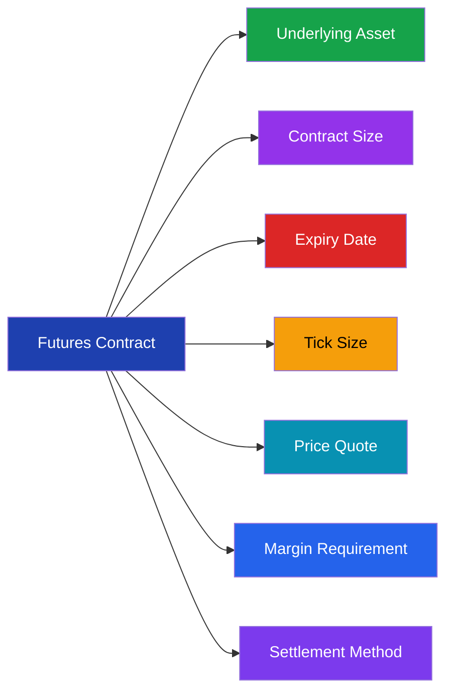
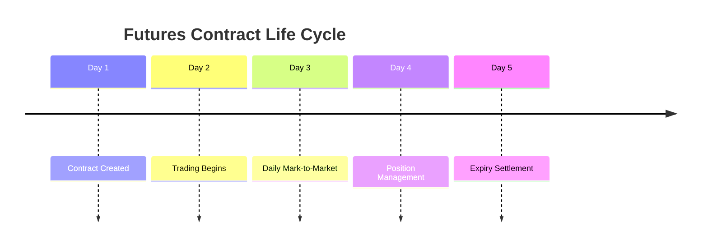

# Futures Contract Specifications

> **Module:** Futures & Options  
> **Chapter:** 02 - Futures Contract Specifications  
> **Level:** Beginner → Intermediate

---

# Learning Objectives

After completing this chapter, you will be able to:

- Understand the components of a futures contract.
- Learn contract size and lot size.
- Understand tick size and tick value.
- Understand expiry dates and contract cycles.
- Learn exchange-defined specifications.
- Read and analyze a futures contract.

---

# Introduction

Every futures contract follows a predefined structure called **contract specifications**.

These specifications are decided by the exchange and ensure:

- Standardization
- Transparency
- Easy trading
- Market efficiency

Unlike forward contracts, futures cannot be customized by individual traders.

---

# Futures Contract Specification Overview



---

# 1. Underlying Asset

The underlying asset is the financial instrument or commodity represented by the futures contract.

Examples:

| Futures Contract | Underlying Asset |
|-|-|
| Nifty Futures | Nifty 50 Index |
| Bank Nifty Futures | Bank Nifty Index |
| Gold Futures | Gold |
| Crude Oil Futures | Crude Oil |
| USDINR Futures | US Dollar |

---

# 2. Contract Size

## Definition

Contract size represents the quantity of the underlying asset covered by one futures contract.

It determines the total value of the contract.

---

## Example

Gold Futures:

```
Contract Size = 100 grams
```

If:

Gold price = ₹7,000 per gram

Contract Value:

```
7,000 × 100

= ₹7,00,000
```

---

# 3. Lot Size

## Definition

Lot size represents the number of units included in one futures contract.

For index futures:

```
Contract Value = Futures Price × Lot Size
```

---

## Example

Nifty Futures:

Futures Price:

```
22,000
```

Lot Size:

```
50 units
```

Contract Value:

```
22,000 × 50

= ₹11,00,000
```

---

# 4. Futures Price Quote

The price at which the futures contract is traded.

Example:

```
Nifty Futures

22,500
```

This represents the market expectation of the future value of Nifty.

---

# 5. Tick Size

## Definition

Tick size is the minimum price movement allowed in a futures contract.

---

## Example

Tick Size:

```
₹0.05
```

Possible prices:

```
100.00
100.05
100.10
100.15
```

A trader cannot place orders between ticks.

---

# 6. Tick Value

Tick value represents the monetary impact of one tick movement.

Formula:

```
Tick Value = Tick Size × Lot Size
```

---

## Example

Tick Size:

₹0.05

Lot Size:

1000 units

Calculation:

```
0.05 × 1000

= ₹50
```

Every one tick movement changes profit/loss by ₹50.

---

# 7. Expiry Date

The expiry date is the final date on which the futures contract exists.

After expiry:

- Contract is settled
- Position is closed
- Profit/loss is calculated

---

# Futures Expiry Cycle



---

# Common Expiry Types

## Weekly Contracts

Short-term contracts.

Example:

- Weekly Index Futures

---

## Monthly Contracts

Most common futures contracts.

Example:

- Near Month
- Next Month
- Far Month

---

# 8. Margin Requirement

Futures trading requires only a margin deposit.

The trader does not pay the full contract value.

---

## Types of Margin

### Initial Margin

Amount required to open a position.

---

### Maintenance Margin

Minimum balance required to maintain the position.

---

### Variation Margin

Daily adjustment due to profit or loss.

---

# 9. Settlement Method

Futures contracts are settled in two ways:

---

## Cash Settlement

No physical delivery.

Only profit/loss difference is paid.

Examples:

- Index Futures

---

## Physical Settlement

Actual delivery of asset occurs.

Examples:

- Some commodity futures

---

# 10. Contract Month

Futures are available for different expiry months.

Example:

```
NIFTY AUG FUT
NIFTY SEP FUT
NIFTY OCT FUT
```

---

# Reading a Futures Contract

Example:

```
NIFTY AUG 22500 FUT
```

Meaning:

| Component | Meaning |
|-|-|
| NIFTY | Underlying |
| AUG | Expiry Month |
| 22500 | Futures Price |
| FUT | Futures Contract |

---

# Exchange Role in Standardization

Exchanges define:

- Contract size
- Expiry dates
- Trading hours
- Margin rules
- Settlement process
- Tick size

Examples:

- NSE
- BSE
- CME

---

# Example: Complete Futures Specification

## Nifty Futures

| Specification | Example |
|-|-|
| Underlying | Nifty 50 |
| Contract Type | Index Futures |
| Lot Size | Exchange defined |
| Expiry | Monthly |
| Settlement | Cash |
| Trading | Exchange |

---

# Why Standardization is Important

Standardization provides:

## 1. Liquidity

More traders can participate.

---

## 2. Transparency

Everyone trades the same contract.

---

## 3. Lower Risk

Exchange controls settlement.

---

## 4. Easy Trading

Contracts can be bought and sold quickly.

---

# Contract Specification vs Forward Contract

| Feature | Futures | Forward |
|-|-|-|
| Standardization | Yes | No |
| Customization | Limited | High |
| Exchange Trading | Yes | No |
| Liquidity | High | Low |
| Risk | Lower | Higher |

---

# Key Terms

| Term | Meaning |
|-|-|
| Contract Size | Quantity covered by contract |
| Lot Size | Number of units in contract |
| Tick Size | Minimum price movement |
| Tick Value | Money impact of one tick |
| Expiry | Contract ending date |
| Margin | Security deposit |
| Settlement | Final payment process |

---

# Summary

- Futures contracts are standardized agreements.
- Exchanges define contract specifications.
- Important specifications include:
  - Underlying asset
  - Contract size
  - Lot size
  - Tick size
  - Expiry date
  - Margin
  - Settlement method
- Understanding specifications is essential before trading futures.

---

# Quick Revision

✔ Contract Size → Quantity covered

✔ Lot Size → Units in one contract

✔ Tick Size → Minimum price movement

✔ Tick Value → Money change per tick

✔ Expiry → Contract ending date

✔ Margin → Security deposit

✔ Settlement → Final contract completion

---

# What's Next?

➡ **03_futures_trading_mechanics.md**

Next chapter:

- Order types
- Buying and selling futures
- Long and short positions
- Margin process
- Mark-to-market settlement