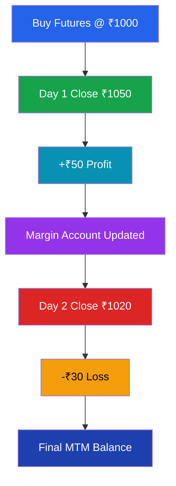
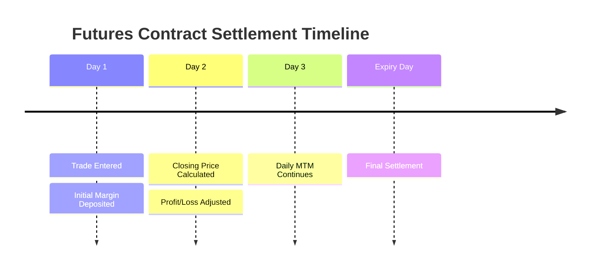

# Mark-to-Market (MTM) Settlement

> **Module:** Futures & Options  
> **Chapter:** 04 - Mark-to-Market Settlement  
> **Level:** Beginner → Intermediate

---

# Learning Objectives

After completing this chapter, you will be able to:

- Understand the meaning of Mark-to-Market settlement.
- Explain why MTM is required in futures markets.
- Calculate daily profit and loss.
- Understand margin adjustments.
- Learn the role of clearing corporations.
- Differentiate between daily settlement and final settlement.

---

# Introduction

**Mark-to-Market (MTM)** is the process of adjusting the value of a futures position every trading day according to the current market price.

In futures markets:

- Profits are credited daily.
- Losses are deducted daily.
- The contract value is reset every day.

This system reduces counterparty risk.

---

# Simple Definition

> Mark-to-Market settlement is the daily process of calculating and settling profit or loss on futures contracts based on the closing market price.

---

# Why MTM Exists?

Without MTM:

- Losses could accumulate for months.
- One party may fail to pay.
- Counterparty risk increases.

With MTM:

- Losses are paid immediately.
- Profits are received immediately.
- Market risk is controlled.

---

# MTM Process Flow


---

# Basic MTM Formula

## For Long Position (Buyer)

```
Daily Profit/Loss

= (Today's Closing Price - Previous Closing Price)
× Lot Size
```

---

## For Short Position (Seller)

```
Daily Profit/Loss

= (Previous Closing Price - Today's Closing Price)
× Lot Size
```

---

# Example 1: Long Futures Position

A trader buys Nifty Futures.

Details:

| Item | Value |
|-|-|
| Buy Price | 22,000 |
| Lot Size | 50 |

---

## Day 1 Closing Price

22,200

Profit:

```
(22,200 - 22,000) × 50

= 200 × 50

= ₹10,000
```

The trader receives:

```
₹10,000
```

---

## Day 2 Closing Price

22,100

Loss from previous day:

```
(22,100 - 22,200) × 50

= -100 × 50

= -₹5,000
```

₹5,000 is deducted.

---

# Example 2: Short Futures Position

A trader sells futures.

Selling Price:

₹1,000

Lot Size:

100

---

## Price Falls to ₹950

Profit:

```
(1,000 - 950) × 100

= 50 × 100

= ₹5,000
```

Seller gains because the price decreased.

---

# Daily Settlement Example



---

# MTM and Margin Account

When a futures trade is opened:

```
Initial Margin Deposited
```

Every day:

```
Profit → Added

Loss → Removed
```

If losses reduce the margin below required level:

```
Margin Call
```

The trader must add more funds.

---

# Margin Call

## Definition

A margin call occurs when the trader must deposit additional money to maintain the required margin level.

---

## Example

Required Margin:

₹50,000

Current Balance:

₹42,000

Shortfall:

```
50,000 - 42,000

= ₹8,000
```

Trader must add:

```
₹8,000
```

---

# MTM Timeline



---

# MTM vs Final Settlement

| Feature | MTM Settlement | Final Settlement |
|-|-|-|
| Timing | Daily | Expiry |
| Purpose | Daily risk control | Contract completion |
| Calculation | Closing price | Final settlement price |
| Frequency | Every trading day | Once |

---

# Role of Clearing Corporation

The clearing corporation:

- Calculates daily obligations.
- Transfers profits and losses.
- Maintains settlement guarantee.
- Reduces counterparty risk.

---

# Advantages of MTM

## 1. Reduces Risk

Losses are settled immediately.

---

## 2. Increases Market Safety

Prevents large unpaid obligations.

---

## 3. Improves Transparency

Everyone knows daily contract value.

---

## 4. Protects Market Participants

Clearing systems manage settlement.

---

# Risks Related to MTM

## 1. Daily Cash Flow Pressure

Losses must be paid immediately.

---

## 2. Margin Calls

Additional funds may be required.

---

## 3. Forced Position Closure

Failure to maintain margin may result in liquidation.

---

# Real-Life Example

A farmer sells wheat futures.

If wheat prices rise:

- Farmer loses in futures market.
- MTM requires daily payment.

But:

- Physical wheat becomes more valuable.
- Overall business risk is reduced.

This is the purpose of hedging.

---

# Key Terms

| Term | Meaning |
|-|-|
| MTM | Daily profit/loss adjustment |
| Closing Price | End-of-day market price |
| Margin Account | Account used for settlement |
| Margin Call | Request for additional funds |
| Initial Margin | Deposit before trading |
| Clearing Corporation | Settlement authority |

---

# Summary

- Mark-to-Market is a daily settlement mechanism.
- Futures profits and losses are adjusted every day.
- Long positions profit when prices rise.
- Short positions profit when prices fall.
- MTM reduces counterparty risk.
- Traders must maintain sufficient margin.

---

# Quick Revision

✔ MTM = Daily settlement

✔ Profit → Credited

✔ Loss → Debited

✔ Long → Benefits from price rise

✔ Short → Benefits from price fall

✔ Margin Call → Additional deposit required

✔ Clearing Corporation → Settlement guarantee

---

# Practice Questions

## Concept Questions

1. What is Mark-to-Market settlement?
2. Why is MTM necessary in futures trading?
3. Explain the role of margin accounts.

---

## Numerical Questions

### Question 1

A trader buys futures at ₹5,000.

Lot size = 200

Closing price = ₹5,050

Calculate MTM profit.

---

### Question 2

A trader sells futures at ₹10,000.

Lot size = 100

Price falls to ₹9,800.

Calculate profit.

---

# What's Next?

➡ **05_futures_pricing.md**

Next chapter:

- Spot price
- Futures price
- Cost of carry model
- Basis
- Premium and discount
- Factors affecting futures prices