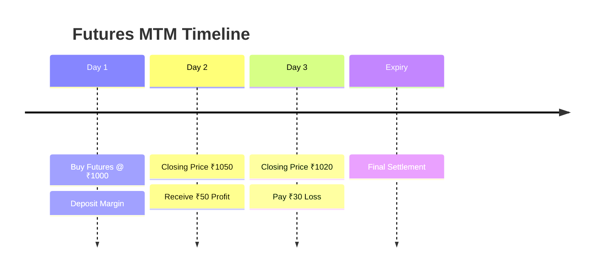

# Mark-to-Market (MTM) Settlement

> **Module:** Futures & Options  
> **Chapter:** 04 - Mark-to-Market Settlement  
> **Level:** Beginner → Intermediate

---

# Learning Objectives

After completing this chapter, you will be able to:

- Understand Mark-to-Market settlement.
- Explain daily profit and loss adjustment.
- Calculate MTM for long and short futures positions.
- Understand margin requirements.
- Learn the role of clearing corporations.
- Differentiate between daily settlement and expiry settlement.

---

# Introduction

In futures trading, contracts are not settled only at expiry.

Instead, every trading day:

- The contract value is recalculated.
- Profits are credited.
- Losses are debited.

This daily adjustment process is called **Mark-to-Market (MTM)**.

---

# Definition

> **Mark-to-Market is the daily process of calculating and settling profit or loss on futures contracts based on the closing market price.**

---

# Why MTM is Required?

Without MTM:

- Losses could accumulate for a long period.
- Traders may default on payments.
- Counterparty risk increases.

MTM ensures:

- Daily risk control.
- Faster settlement.
- Market stability.

---

# Futures Settlement Flow

flowchart TD

A["Open Futures Position"]
--> B["Day End Closing Price"]

B --> C["Compare With Previous Price"]

C --> D{"Price Movement"}

D -->|Price Goes Up| E["Long Position Profit"]
D -->|Price Goes Down| F["Long Position Loss"]

D -->|Price Goes Down| G["Short Position Profit"]
D -->|Price Goes Up| H["Short Position Loss"]

E --> I["Credit Margin Account"]
F --> J["Debit Margin Account"]

G --> I
H --> J

style A fill:#1E40AF,color:#ffffff
style B fill:#16A34A,color:#ffffff
style C fill:#9333EA,color:#ffffff
style D fill:#F59E0B,color:#000000
style E fill:#0891B2,color:#ffffff
style F fill:#DC2626,color:#ffffff
style G fill:#0891B2,color:#ffffff
style H fill:#DC2626,color:#ffffff
style I fill:#16A34A,color:#ffffff
style J fill:#DC2626,color:#ffffff
---

# How MTM Works

Every trading day:

```
Opening Futures Price

        ↓

Closing Market Price

        ↓

Calculate Difference

        ↓

Profit Added / Loss Deducted

        ↓

Updated Margin Balance
```

---

# MTM Formula

## Long Position (Buyer)

A buyer profits when futures prices increase.

Formula:

```
Profit/Loss =
(Current Price - Previous Price) × Lot Size
```

---

## Short Position (Seller)

A seller profits when futures prices decrease.

Formula:

```
Profit/Loss =
(Previous Price - Current Price) × Lot Size
```

---

# Example 1: Long Futures Position

A trader buys Nifty Futures.

| Details | Value |
|---|---:|
| Buy Price | ₹22,000 |
| Lot Size | 50 |
| Closing Price | ₹22,200 |

Calculation:

```
(22,200 - 22,000) × 50

= 200 × 50

= ₹10,000
```

Result:

```
Profit = ₹10,000
```

The amount is credited to the trader's margin account.

---

# Example 2: Long Position Loss

Buy Price:

```
₹22,000
```

Next day closing price:

```
₹21,800
```

Lot Size:

```
50
```

Calculation:

```
(21,800 - 22,000) × 50

= -200 × 50

= -₹10,000
```

Result:

```
Loss = ₹10,000
```

The amount is deducted from margin.

---

# Example 3: Short Futures Position

A trader sells futures.

| Details | Value |
|---|---:|
| Sell Price | ₹1,000 |
| Lot Size | 100 |

Price falls to:

```
₹950
```

Calculation:

```
(1,000 - 950) × 100

= 50 × 100

= ₹5,000
```

Result:

```
Profit = ₹5,000
```

---

# MTM Daily Cycle


---

# Margin Account

When a futures position is opened:

```
Trader deposits Initial Margin
```

Daily:

| Result | Action |
|---|---|
| Profit | Added to account |
| Loss | Deducted from account |

---

# Margin Call

## Meaning

A margin call occurs when the account balance falls below the required margin level.

The trader must add additional funds.

---

## Example

Required Margin:

```
₹50,000
```

Available Balance:

```
₹40,000
```

Shortfall:

```
₹50,000 - ₹40,000

= ₹10,000
```

Trader must deposit:

```
₹10,000
```

---

# Role of Clearing Corporation

The clearing corporation acts as an intermediary between buyers and sellers.

Responsibilities:

- Calculates MTM obligations.
- Transfers profits and losses.
- Maintains settlement guarantee.
- Reduces default risk.

---

# MTM vs Final Settlement

| Feature | MTM Settlement | Final Settlement |
|---|---|---|
| Timing | Daily | Expiry |
| Purpose | Risk management | Contract completion |
| Frequency | Every trading day | Once |
| Price Used | Closing price | Final settlement price |

---

# MTM Example Timeline



---

# Advantages of MTM

## Risk Reduction

Losses are settled immediately.

## Transparency

Daily prices reflect market reality.

## Safety

Reduces chances of default.

## Liquidity

Allows continuous trading.

---

# Risks of MTM

## 1. Daily Cash Requirement

Losses must be paid immediately.

## 2. Margin Pressure

Large price movements can trigger margin calls.

## 3. Forced Liquidation

Failure to maintain margin may close positions.

---

# Real-Life Hedging Example

An airline buys fuel futures.

If crude oil prices rise:

- Fuel cost increases.
- Futures position gains value.

The MTM profit helps offset higher fuel expenses.

---

# Key Terms

| Term | Meaning |
|---|---|
| MTM | Daily profit/loss settlement |
| Closing Price | End-of-day market price |
| Margin | Security deposit |
| Margin Call | Additional funds required |
| Clearing Corporation | Settlement authority |
| Long Position | Buyer of futures |
| Short Position | Seller of futures |

---

# Summary

- MTM is a daily settlement process.
- Futures profits and losses are adjusted every day.
- Long traders benefit from rising prices.
- Short traders benefit from falling prices.
- Margin accounts are updated daily.
- MTM reduces market risk.

---

# Quick Revision

✔ MTM = Daily settlement

✔ Profit → Credit

✔ Loss → Debit

✔ Long → Profit when price rises

✔ Short → Profit when price falls

✔ Margin Call → Additional deposit

✔ Clearing Corporation → Settlement safety

---

# Practice Questions

## Concept Questions

1. What is Mark-to-Market settlement?
2. Why is MTM important in futures markets?
3. Explain the role of margin accounts.

---

## Numerical Questions

### Question 1

A trader buys futures at ₹5,000.

Lot size = 200

Closing price = ₹5,050

Calculate MTM profit.

---

### Question 2

A trader sells futures at ₹10,000.

Lot size = 100

Price falls to ₹9,800.

Calculate profit.

---

# What's Next?

➡ **05_futures_pricing.md**

Next chapter:

- Spot price
- Futures price
- Cost of carry model
- Basis
- Premium and discount
- Factors affecting futures prices