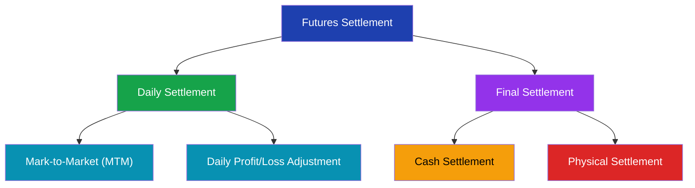
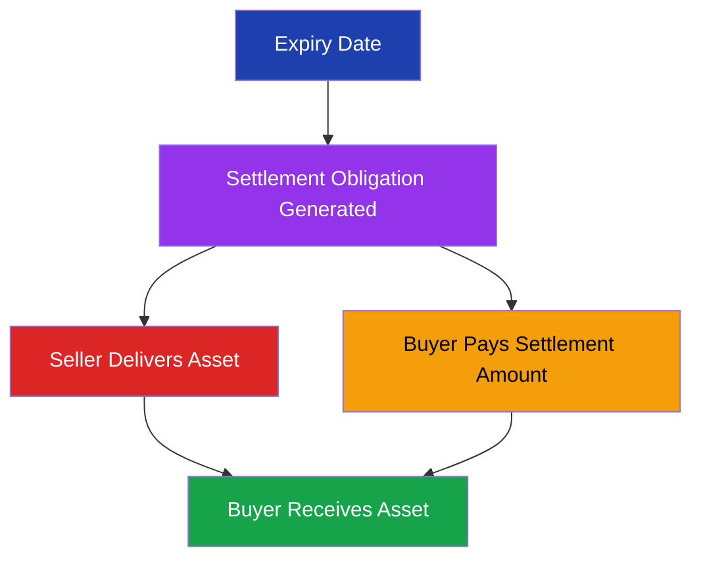
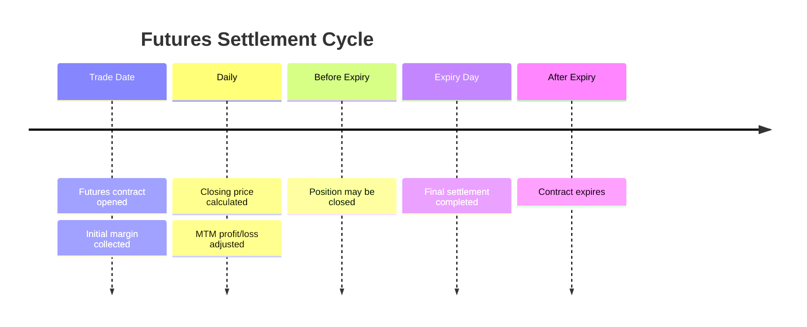

# Futures Settlement Process

> **Module:** Futures & Options  
> **Chapter:** 05 - Futures Settlement Process  
> **Level:** Beginner → Intermediate

---

# Learning Objectives

After completing this chapter, you will be able to:

- Understand how futures contracts are settled.
- Explain the role of clearing corporations.
- Differentiate between cash settlement and physical settlement.
- Understand daily settlement and expiry settlement.
- Learn the complete futures settlement cycle.

---

# Introduction

A futures contract is an agreement between two parties to buy or sell an asset at a future date.

However, the contract does not continue forever.

Every futures contract must eventually be settled.

Settlement means:

> The process through which obligations of buyers and sellers are completed.

---

# Futures Settlement Types

There are two major types of settlement:



---

# 1. Daily Settlement

Daily settlement happens throughout the life of the futures contract.

At the end of every trading day:

1. Closing price is calculated.
2. Profit and loss are calculated.
3. Margin accounts are adjusted.

This process is called:

**Mark-to-Market Settlement (MTM)**

---

# Daily Settlement Flow


---

# 2. Final Settlement

Final settlement occurs when the futures contract reaches expiry.

At expiry:

- Contract obligation is completed.
- Final settlement price is calculated.
- Remaining payment is settled.

---

# Cash Settlement

## Meaning

In cash settlement, no physical asset is delivered.

Only the difference between:

- Contract price
- Settlement price

is paid in cash.

---

## Examples

Commonly cash settled:

| Contract | Settlement |
|---|---|
| Index Futures | Cash |
| Index Options | Cash |
| Some Currency Contracts | Cash |

---

# Example: Cash Settlement

A trader buys Nifty Futures.

Contract Price:

```
22,000
```

Expiry Price:

```
22,500
```

Lot Size:

```
50
```

Calculation:

```
(22,500 - 22,000) × 50

= 500 × 50

= ₹25,000
```

Profit:

```
₹25,000
```

No shares are delivered.

Only cash difference is settled.

---

# Physical Settlement

## Meaning

Physical settlement means actual delivery of the underlying asset.

The seller delivers the asset.

The buyer receives the asset.

---

## Examples

Physical settlement may apply to:

- Stock futures
- Stock options

---

# Physical Settlement Process



---

# Role of Clearing Corporation

The clearing corporation manages settlement between buyers and sellers.

Responsibilities:

- Acts as intermediary.
- Calculates obligations.
- Collects margins.
- Transfers funds.
- Ensures settlement completion.
- Reduces counterparty risk.

---

# Settlement Cycle



---

# Buyer and Seller Obligations

| Participant | Obligation |
|---|---|
| Futures Buyer | Pay settlement amount |
| Futures Seller | Deliver asset (physical settlement) |
| Clearing Corporation | Ensure settlement |

---

# Closing a Futures Position Before Expiry

A trader does not always wait until expiry.

A position can be closed by taking an opposite position.

Example:

Initial position:

```
Buy Nifty Futures
```

Later:

```
Sell Nifty Futures
```

The position is squared off.

---

# Open Interest and Settlement

Open interest represents active futures contracts.

When traders close positions:

- Open interest decreases.
- Settlement obligation reduces.

---

# Settlement Price

Settlement price is the price used for calculating final obligations.

It may be based on:

- Exchange-defined methodology.
- Closing market prices.
- Average prices.

---

# Difference Between MTM and Final Settlement

| Feature | MTM Settlement | Final Settlement |
|---|---|---|
| Frequency | Daily | Once |
| Purpose | Manage daily risk | Complete contract |
| Price Used | Closing price | Final settlement price |
| Occurs | During contract life | Expiry |

---

# Advantages of Proper Settlement System

## Risk Control

Reduces chances of default.

## Transparency

Clear calculation of obligations.

## Market Confidence

Encourages participation.

## Efficiency

Ensures smooth trading operations.

---

# Risks in Settlement

## 1. Settlement Risk

Failure of a party to complete obligations.

## 2. Liquidity Risk

Insufficient funds for settlement.

## 3. Operational Risk

Errors in processing transactions.

---

# Real-Life Example

A farmer sells wheat futures.

At expiry:

- If cash settled → price difference is paid.
- If physically settled → wheat is delivered.

The settlement method depends on the contract rules.

---

# Key Terms

| Term | Meaning |
|---|---|
| Settlement | Completion of futures obligation |
| MTM | Daily profit/loss adjustment |
| Expiry | Contract end date |
| Cash Settlement | Payment of price difference |
| Physical Settlement | Actual delivery of asset |
| Clearing Corporation | Settlement intermediary |
| Settlement Price | Price used for final calculation |

---

# Summary

- Futures contracts require settlement.
- Daily settlement adjusts profits and losses.
- Final settlement occurs at expiry.
- Settlement can be cash or physical.
- Clearing corporations ensure safe completion.
- Proper settlement reduces market risk.

---

# Quick Revision

✔ MTM → Daily settlement

✔ Expiry → Final settlement

✔ Cash Settlement → Money difference only

✔ Physical Settlement → Actual delivery

✔ Clearing Corporation → Settlement safety

---

# Practice Questions

## Concept Questions

1. What is futures settlement?

2. Explain daily settlement.

3. Differentiate between cash and physical settlement.

4. What is the role of clearing corporations?

---

## Numerical Question

A trader buys futures at ₹1,500.

Expiry price = ₹1,650

Lot size = 200

Calculate settlement profit.

---

# What's Next?

➡ **06_futures_pricing.md**

Next chapter:

- Spot price
- Futures price
- Cost of carry model
- Basis
- Factors affecting futures pricing