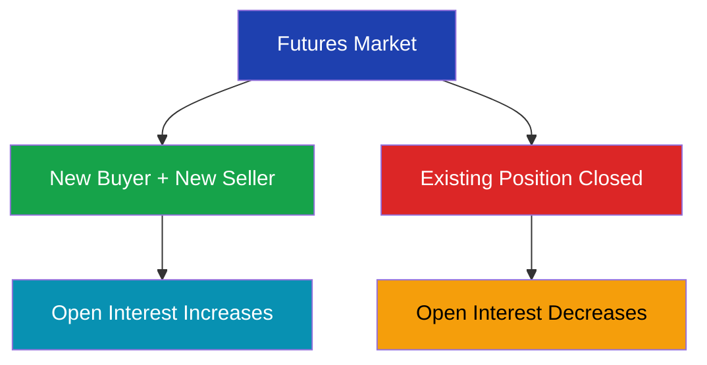
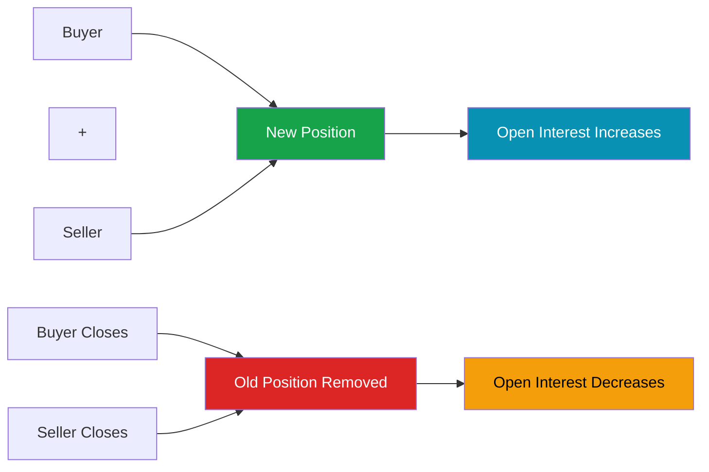

# Open Interest in Futures Market

> **Module:** Futures & Options  
> **Chapter:** 06 - Open Interest  
> **Level:** Beginner → Intermediate

---

# Learning Objectives

After completing this chapter, you will be able to:

- Understand the meaning of open interest.
- Differentiate between open interest and trading volume.
- Learn how open interest changes.
- Interpret price and open interest relationships.
- Understand the importance of open interest in futures analysis.

---

# Introduction

In futures markets, thousands of contracts are traded every day.

Some traders close their positions, while others create new positions.

To understand market activity, traders use an important indicator:

**Open Interest (OI)**

---

# Definition

> **Open Interest is the total number of outstanding futures contracts that are currently active and have not been closed, expired, or settled.**

It represents the number of active contracts in the market.

---

# Simple Example

Suppose:

Trader A buys 1 Nifty Futures contract.

Trader B sells 1 Nifty Futures contract.

A new contract is created.

Open Interest:

```
1 Contract
```

---

If another trader enters:

Trader C buys.

Trader D sells.

Another contract is created.

Open Interest:

```
2 Contracts
```

---

# Open Interest Flow



---

# Open Interest vs Volume

Many beginners confuse open interest with trading volume.

| Feature | Open Interest | Volume |
|---|---|---|
| Meaning | Active contracts | Total contracts traded |
| Changes | When positions open/close | Every transaction |
| Time | End of day usually | Throughout trading day |
| Shows | Market participation | Trading activity |

---

# Example: Volume vs Open Interest

During one day:

```
1000 Futures contracts traded
```

But:

```
Only 200 new contracts created
```

Volume:

```
1000
```

Open Interest:

```
+200
```

---

# How Open Interest Changes

There are four possibilities:



---

# Price and Open Interest Relationship

Traders analyze price movement together with open interest.

---

# 1. Price Rising + Open Interest Rising

Meaning:

- New buyers are entering.
- Fresh money is coming into the market.

Interpretation:

```
Bullish Trend
```

Example:

```
Price ↑
OI ↑
```

---

# 2. Price Rising + Open Interest Falling

Meaning:

- Existing short sellers are closing positions.

Interpretation:

```
Short Covering
```

Example:

```
Price ↑
OI ↓
```

---

# 3. Price Falling + Open Interest Rising

Meaning:

- New short positions are being created.

Interpretation:

```
Bearish Trend
```

Example:

```
Price ↓
OI ↑
```

---

# 4. Price Falling + Open Interest Falling

Meaning:

- Traders are closing positions.

Interpretation:

```
Long Unwinding
```

Example:

```
Price ↓
OI ↓
```

---

# Price-OI Analysis Table

| Price | Open Interest | Interpretation |
|---|---|---|
| ↑ | ↑ | New buying / Bullish |
| ↑ | ↓ | Short covering |
| ↓ | ↑ | New selling / Bearish |
| ↓ | ↓ | Long unwinding |

---

# Open Interest Example

Suppose Nifty Futures:

Day 1:

```
Price = 22,000
OI = 10 lakh contracts
```

Day 2:

```
Price = 22,300
OI = 12 lakh contracts
```

Analysis:

Price increased.

Open interest increased.

Conclusion:

```
Fresh buying interest
```

---

# Importance of Open Interest

## 1. Measures Market Participation

Higher OI indicates more active positions.

---

## 2. Helps Identify Trends

OI combined with price helps traders understand market direction.

---

## 3. Shows Liquidity

Higher OI usually means:

- More participants.
- Better liquidity.
- Easier trading.

---

## 4. Helps Derivative Analysis

Professional traders use OI with:

- Price
- Volume
- Volatility

---

# Open Interest in Options Market

In options:

Open interest exists separately for:

- Call options
- Put options

Example:

| Contract | Open Interest |
|---|---:|
| Nifty 22000 Call | 5 lakh |
| Nifty 22000 Put | 8 lakh |

---

# Highest Open Interest

The strike price with highest OI often indicates:

- Important support level (Put OI)
- Important resistance level (Call OI)

---

# Open Interest and Liquidity

Higher open interest generally provides:

- More buyers and sellers.
- Lower bid-ask spread.
- Easier position entry and exit.

---

# Limitations of Open Interest

Open interest alone cannot predict markets.

Reasons:

- Does not show direction.
- Does not identify buyer or seller strength.
- Requires price confirmation.

Always analyze:

- Price
- Volume
- Open Interest

together.

---

# Open Interest vs Outstanding Shares

| Futures Market | Stock Market |
|---|---|
| Open Interest | Outstanding Shares |
| Active contracts | Issued shares |
| Changes daily | Changes less frequently |

---

# Key Terms

| Term | Meaning |
|---|---|
| Open Interest | Active futures contracts |
| Volume | Total contracts traded |
| Long Position | Buying futures |
| Short Position | Selling futures |
| Short Covering | Closing short positions |
| Long Unwinding | Closing long positions |

---

# Summary

- Open Interest measures active futures contracts.
- New positions increase OI.
- Closing positions decrease OI.
- OI helps analyze market participation.
- Price and OI together provide useful trading signals.
- OI does not predict markets alone.

---

# Quick Revision

✔ OI = Active contracts

✔ New buyer + new seller → OI increases

✔ Closing positions → OI decreases

✔ Price ↑ + OI ↑ → Bullish

✔ Price ↓ + OI ↑ → Bearish

✔ Volume ≠ Open Interest

---

# Practice Questions

## Concept Questions

1. Define open interest.

2. Explain the difference between volume and open interest.

3. What does rising price with rising OI indicate?

4. Why is open interest important?

---

## Analysis Questions

A futures contract shows:

```
Price ↑
Open Interest ↑
```

What does it indicate?

---

A futures contract shows:

```
Price ↓
Open Interest ↓
```

What does it indicate?

---

# What's Next?

➡ **07_futures_trading_strategies.md**

Next chapter:

- Long futures strategy
- Short futures strategy
- Hedging strategies
- Speculation using futures
- Risk management