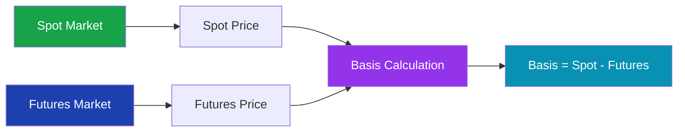
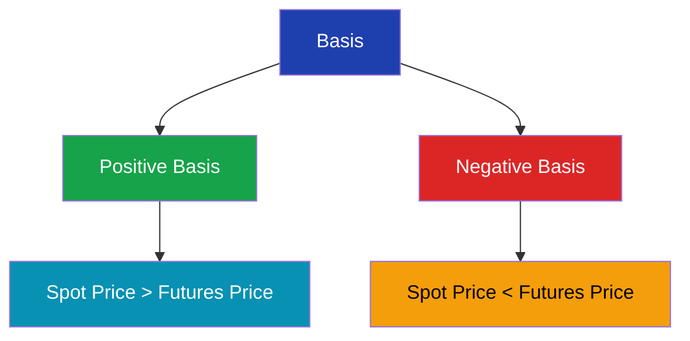
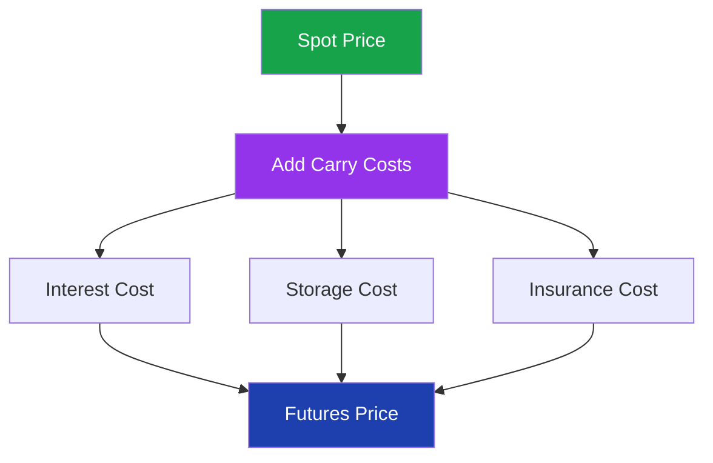
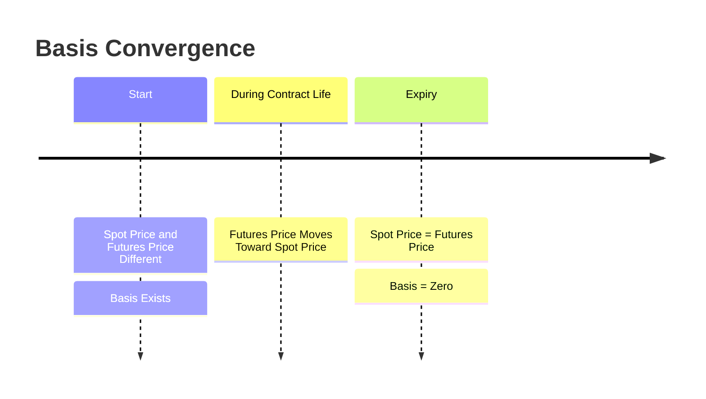

# Basis in Futures Market

> **Module:** Futures & Options  
> **Chapter:** 07 - Basis  
> **Level:** Beginner → Intermediate

---

# Learning Objectives

After completing this chapter, you will be able to:

- Understand the meaning of basis.
- Learn the relationship between spot price and futures price.
- Calculate basis.
- Understand positive and negative basis.
- Explain basis risk in hedging.
- Use basis for futures market analysis.

---

# Introduction

In futures markets, two important prices exist:

1. **Spot Price**
2. **Futures Price**

The difference between these two prices is called:

**Basis**

---

# Definition

> **Basis is the difference between the spot price of an asset and its futures price.**

Formula:

```
Basis = Spot Price - Futures Price
```

---

# Basic Concept

Example:

Gold Spot Price:

```
₹60,000
```

Gold Futures Price:

```
₹60,500
```

Calculation:

```
Basis = 60,000 - 60,500

= -₹500
```

Therefore:

```
Basis = -₹500
```

---

# Spot Price vs Futures Price



---

# Types of Basis

There are two major types:



---

# Positive Basis

## Meaning

Positive basis occurs when:

```
Spot Price > Futures Price
```

Example:

Spot Price:

```
₹1,050
```

Futures Price:

```
₹1,000
```

Calculation:

```
Basis = 1050 - 1000

= +₹50
```

---

# Negative Basis

## Meaning

Negative basis occurs when:

```
Spot Price < Futures Price
```

Example:

Spot Price:

```
₹950
```

Futures Price:

```
₹1,000
```

Calculation:

```
Basis = 950 - 1000

= -₹50
```

---

# Why Does Basis Exist?

The difference between spot and futures price occurs because of:

- Cost of carrying the asset.
- Interest cost.
- Storage cost.
- Insurance cost.
- Expected dividends.
- Market expectations.

---

# Cost of Carry Relationship

Futures price is generally calculated as:

```
Futures Price =
Spot Price + Cost of Carry
```

Where cost of carry includes:

```
Interest
+
Storage
+
Insurance
-
Income
```

---

# Cost of Carry Model



---

# Basis and Futures Expiry

As expiry approaches:

```
Spot Price ≈ Futures Price
```

Therefore:

```
Basis approaches zero
```

This process is called:

**Basis Convergence**

---

# Basis Convergence



---

# Example of Basis Convergence

Today:

```
Spot Price = ₹1000

Futures Price = ₹1050
```

Basis:

```
1000 - 1050

= -₹50
```

At expiry:

```
Spot Price = ₹1020

Futures Price = ₹1020
```

Basis:

```
1020 - 1020

= Zero
```

---

# Basis Risk

## Meaning

Basis risk is the risk that the basis changes unexpectedly during a hedge.

A perfect hedge is difficult because:

- Futures price changes.
- Spot price changes.
- Basis changes.

---

# Hedging Example

A farmer expects to sell wheat after 3 months.

Current:

```
Spot Wheat Price = ₹2000
Futures Price = ₹2050
```

Farmer sells futures.

After 3 months:

```
Spot Price = ₹1900

Futures Price = ₹1950
```

Loss in spot market:

```
2000 - 1900

= ₹100
```

Gain in futures:

```
2050 - 1950

= ₹100
```

Hedge works.

---

# Basis Risk Example

Suppose:

Spot falls:

```
₹2000 → ₹1900
```

Futures falls:

```
₹2050 → ₹1980
```

Spot loss:

```
₹100
```

Futures gain:

```
₹70
```

Difference:

```
₹30
```

This remaining risk is:

```
Basis Risk
```

---

# Importance of Basis

## 1. Hedging Decisions

Helps determine hedge effectiveness.

---

## 2. Futures Pricing

Shows relationship between markets.

---

## 3. Market Analysis

Traders study basis changes to understand:

- Demand
- Supply
- Market expectations

---

# Basis in Different Markets

| Market | Basis Example |
|---|---|
| Commodity | Spot Gold vs Gold Futures |
| Agriculture | Wheat Spot vs Wheat Futures |
| Index | Nifty Spot vs Nifty Futures |
| Currency | USD/INR Spot vs Futures |

---

# Basis vs Spread

| Basis | Spread |
|---|---|
| Difference between spot and futures | Difference between two futures contracts |
| Used mainly for hedging | Used for trading strategies |
| Spot related | Contract related |

---

# Key Terms

| Term | Meaning |
|---|---|
| Basis | Difference between spot and futures price |
| Spot Price | Current market price |
| Futures Price | Contract price for future delivery |
| Positive Basis | Spot above futures |
| Negative Basis | Spot below futures |
| Basis Risk | Risk from basis changes |
| Convergence | Futures moves toward spot |

---

# Summary

- Basis is the difference between spot and futures price.
- Formula:

```
Basis = Spot Price - Futures Price
```

- Basis may be positive or negative.
- Basis moves toward zero at expiry.
- Basis risk affects hedging effectiveness.
- Traders and hedgers monitor basis closely.

---

# Quick Revision

✔ Basis = Spot - Futures

✔ Positive Basis → Spot > Futures

✔ Negative Basis → Spot < Futures

✔ Expiry → Basis becomes zero

✔ Basis Risk → Unexpected basis movement

✔ Cost of Carry affects futures price

---

# Practice Questions

## Concept Questions

1. Define basis.

2. Explain positive and negative basis.

3. Why does basis converge at expiry?

4. What is basis risk?

---

## Numerical Questions

### Question 1

Spot Price:

```
₹2500
```

Futures Price:

```
₹2600
```

Calculate basis.

---

### Question 2

Spot Price:

```
₹5000
```

Futures Price:

```
₹4950
```

Calculate basis.

---

# What's Next?

➡ **08_futures_strategies.md**

Next chapter:

- Long futures strategy
- Short futures strategy
- Hedging with futures
- Speculation strategies
- Risk management techniques