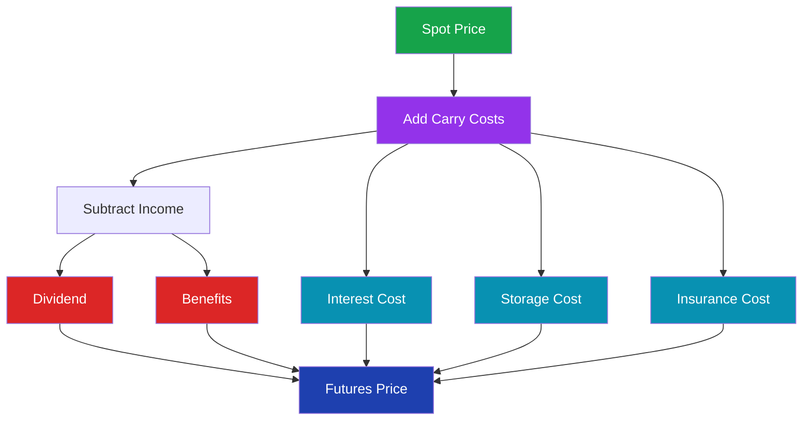
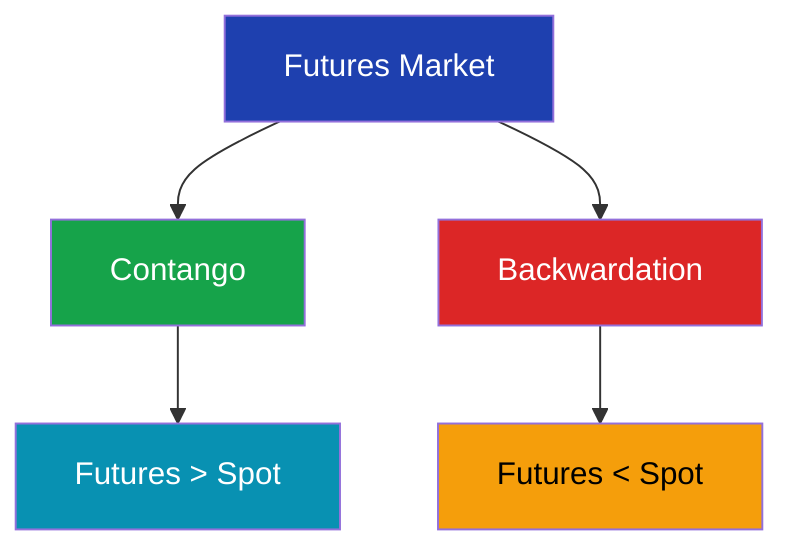

# Cost of Carry Model in Futures Pricing

> **Module:** Futures & Options  
> **Chapter:** 08 - Cost of Carry  
> **Level:** Beginner → Intermediate

---

# Learning Objectives

After completing this chapter, you will be able to:

- Understand the meaning of cost of carry.
- Learn how futures prices are calculated.
- Understand the relationship between spot price and futures price.
- Identify components of carrying costs.
- Calculate theoretical futures price.
- Understand the impact of dividends and income.

---

# Introduction

The price of a futures contract is not random.

It is linked to the current price of the underlying asset.

The relationship between:

- Spot price
- Interest cost
- Storage cost
- Income from asset

determines the futures price.

This relationship is explained by the:

**Cost of Carry Model**

---

# Definition

> **Cost of Carry is the total cost of holding an asset from the present time until the futures contract expiry date.**

It explains why futures prices may trade above or below spot prices.

---

# Basic Formula

```
Futures Price = Spot Price + Cost of Carry
```

or

```
F = S + C
```

Where:

| Symbol | Meaning |
|---|---|
| F | Futures Price |
| S | Spot Price |
| C | Cost of Carry |

---

# Cost of Carry Components



---

# Components of Cost of Carry

## 1. Interest Cost

When buying an asset, money is invested.

The opportunity cost of money is the interest rate.

Example:

Buying gold today requires capital.

That capital could have earned interest elsewhere.

---

## 2. Storage Cost

Physical commodities require storage.

Examples:

- Gold
- Silver
- Crude Oil
- Agricultural products

Storage charges increase futures price.

---

## 3. Insurance Cost

Physical assets may require protection.

Examples:

- Warehouse insurance
- Commodity insurance

---

## 4. Income or Benefits

Some assets generate income.

Examples:

- Stock dividends
- Interest payments

Income reduces carrying cost.

---

# Cost of Carry Formula

For financial assets:

```
Futures Price = Spot Price × (1 + r)^t
```

Where:

| Symbol | Meaning |
|---|---|
| r | Interest rate |
| t | Time period |

---

# Continuous Cost of Carry Model

For professional pricing:

```
F = S × e^(r-q)t
```

Where:

| Symbol | Meaning |
|---|---|
| F | Futures Price |
| S | Spot Price |
| r | Risk-free interest rate |
| q | Income yield |
| t | Time to expiry |

---

# Futures Pricing Flow


---

# Example 1: Simple Cost of Carry

Given:

Spot Price:

```
₹10,000
```

Interest Rate:

```
10% per year
```

Time:

```
1 year
```

Calculation:

```
F = 10,000 × (1 + 0.10)

F = ₹11,000
```

Theoretical Futures Price:

```
₹11,000
```

---

# Example 2: Cost of Carry with Storage

Spot Price:

```
₹50,000
```

Interest Cost:

```
₹2,000
```

Storage Cost:

```
₹500
```

Insurance:

```
₹200
```

Calculation:

```
Futures Price

= 50,000 + 2,000 + 500 + 200

= ₹52,700
```

---

# Effect of Dividends

Stocks provide dividends.

Dividends reduce futures price.

Formula:

```
Futures Price =
Spot Price + Carry Cost - Dividend
```

---

# Example

Stock Price:

```
₹1,000
```

Interest Cost:

```
₹50
```

Dividend:

```
₹20
```

Calculation:

```
F = 1000 + 50 - 20

= ₹1,030
```

---

# Contango and Backwardation

## Contango

When:

```
Futures Price > Spot Price
```

Usually occurs when:

- Carry costs are positive.
- Storage costs are high.

---

## Backwardation

When:

```
Futures Price < Spot Price
```

Occurs when:

- Demand for immediate delivery is high.
- Benefits of holding asset are high.

---

# Contango vs Backwardation



---

# Relationship With Basis

Recall:

```
Basis = Spot Price - Futures Price
```

If:

```
Futures > Spot
```

Then:

```
Basis is Negative
```

If:

```
Spot > Futures
```

Then:

```
Basis is Positive
```

---

# Cost of Carry in Different Markets

| Market | Carry Factors |
|---|---|
| Gold Futures | Interest + Storage |
| Stock Futures | Interest - Dividend |
| Commodity Futures | Storage + Insurance |
| Currency Futures | Interest Rate Difference |
| Index Futures | Interest - Dividend Yield |

---

# Currency Futures Example

Currency futures depend on:

- Domestic interest rate
- Foreign interest rate

Example:

USD/INR Futures are affected by:

- Indian interest rates
- US interest rates

---

# Importance of Cost of Carry

## 1. Futures Pricing

Helps determine fair futures value.

---

## 2. Arbitrage

If market futures price differs from theoretical price:

Traders may exploit the difference.

---

## 3. Hedging

Helps businesses estimate future costs.

---

# Arbitrage Using Cost of Carry

If:

Market Futures Price:

```
₹12,000
```

Fair Futures Price:

```
₹11,500
```

The futures contract is overpriced.

An arbitrageur may:

- Sell futures.
- Buy underlying asset.

---

# Limitations of Cost of Carry Model

- Interest rates may change.
- Storage costs may vary.
- Demand and supply affect prices.
- Market expectations influence futures prices.

---

# Key Terms

| Term | Meaning |
|---|---|
| Cost of Carry | Cost of holding asset |
| Spot Price | Current market price |
| Futures Price | Future contract price |
| Contango | Futures above spot |
| Backwardation | Futures below spot |
| Dividend Yield | Income from asset |
| Arbitrage | Profit from price differences |

---

# Summary

- Futures prices are linked to spot prices.
- Cost of carry explains futures pricing.
- Carry costs include interest, storage, and insurance.
- Income like dividends reduces futures price.
- Contango occurs when futures exceed spot.
- Backwardation occurs when futures are below spot.

---

# Quick Revision

✔ Futures = Spot + Carry Cost

✔ Interest increases futures price

✔ Storage increases futures price

✔ Dividend decreases futures price

✔ Contango → Futures > Spot

✔ Backwardation → Futures < Spot

✔ Cost of carry helps find fair futures value

---

# Practice Questions

## Concept Questions

1. Define cost of carry.

2. Explain components of carrying cost.

3. Why do dividends reduce futures price?

4. Explain contango and backwardation.

---

## Numerical Questions

### Question 1

Spot Price:

```
₹20,000
```

Interest Cost:

```
₹1,000
```

Storage Cost:

```
₹200
```

Calculate futures price.

---

### Question 2

Spot Price:

```
₹5,000
```

Carry Cost:

```
₹300
```

Dividend:

```
₹100
```

Find theoretical futures price.

---

# What's Next?

➡ **09_futures_trading_strategies.md**

Next chapter:

- Long futures position
- Short futures position
- Hedging strategies
- Speculation strategies
- Risk management using futures