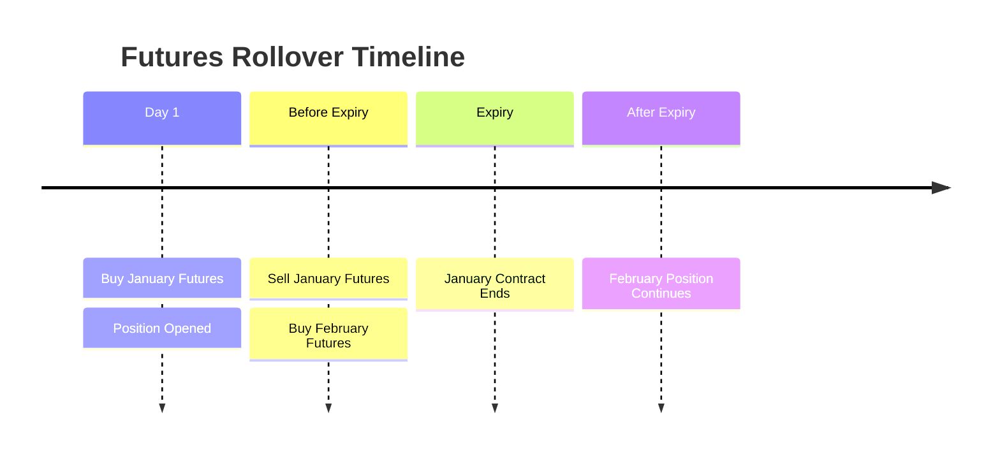
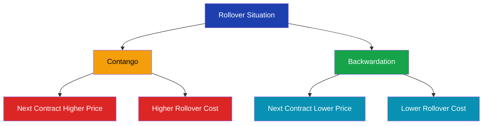

# Futures Rollover

> **Module:** Futures & Options  
> **Chapter:** 09 - Futures Rollover  
> **Level:** Beginner → Intermediate

---

# Learning Objectives

After completing this chapter, you will be able to:

- Understand the meaning of futures rollover.
- Explain why traders rollover futures positions.
- Learn rollover process.
- Understand rollover cost.
- Calculate rollover impact.
- Differentiate between expiry and rollover.

---

# Introduction

Futures contracts have a fixed expiry date.

A trader cannot hold the same futures contract forever.

Before expiry, traders have two choices:

1. Close the existing position.
2. Transfer the position to the next expiry month.

This transfer process is called:

**Futures Rollover**

---

# Definition

> **Futures rollover is the process of shifting an existing futures position from the current expiry contract to a future expiry contract.**

Example:

A trader holding:

```
January Nifty Futures
```

moves the position to:

```
February Nifty Futures
```

---

# Why Rollover is Needed?

Traders rollover because:

- They want to maintain their market view.
- They do not want to close their position.
- Their strategy requires a longer holding period.
- They want to avoid expiry settlement.

---

# Basic Rollover Process


---

# Example: Long Futures Rollover

A trader buys:

```
January Nifty Futures
```

The trader expects Nifty to rise for another two months.

Instead of closing the position:

He:

1. Sells January Futures.
2. Buys February Futures.

The market exposure continues.

---

# Example: Short Futures Rollover

A trader sells:

```
January Crude Oil Futures
```

He expects prices to fall.

Before expiry:

- Buys back January contract.
- Sells February contract.

The short position continues.

---

# Rollover Timeline



---

# Rollover Steps

## Step 1: Identify Expiry

Trader checks:

- Current contract expiry date.
- Next available expiry.

---

## Step 2: Close Existing Contract

Example:

```
Sell January Futures
```

(for an existing long position)

---

## Step 3: Open New Contract

Example:

```
Buy February Futures
```

---

## Step 4: Continue Strategy

The trader maintains the same market exposure.

---

# Rollover Cost

The price difference between two contracts creates rollover cost.

Formula:

```
Rollover Cost =
Next Month Futures Price
-
Current Month Futures Price
```

---

# Example

Current Month Futures:

```
₹20,000
```

Next Month Futures:

```
₹20,200
```

Calculation:

```
20,200 - 20,000

= ₹200
```

Rollover cost:

```
₹200
```

---

# Contango Rollover

When:

```
Next Month Futures > Current Month Futures
```

Example:

```
January Futures = 20,000

February Futures = 20,200
```

The trader pays extra to rollover.

---

# Backwardation Rollover

When:

```
Next Month Futures < Current Month Futures
```

Example:

```
January Futures = 20,000

February Futures = 19,800
```

Rollover may provide benefit.

---

# Contango vs Backwardation



---

# Rollover in Index Futures

Example:

A fund manager holds:

```
10 Nifty Futures Contracts
```

Current:

```
March Futures
```

Before expiry:

Moves to:

```
April Futures
```

Reason:

The manager wants continued market exposure.

---

# Rollover Percentage

Market participants track rollover percentage.

Formula:

```
Rollover %

=
Contracts Shifted to Next Month
÷
Total Open Contracts

× 100
```

---

# Example

Total Open Contracts:

```
1,00,000
```

Contracts Rolled:

```
75,000
```

Calculation:

```
75,000 / 1,00,000 × 100

= 75%
```

Rollover percentage:

```
75%
```

---

# Importance of Rollover Data

Traders analyze rollover to understand:

- Market sentiment.
- Institutional activity.
- Future expectations.

---

# High Rollover Meaning

High rollover may indicate:

- Traders maintaining positions.
- Strong conviction.
- Continued market interest.

---

# Low Rollover Meaning

Low rollover may indicate:

- Traders closing positions.
- Uncertainty.
- Weak market participation.

---

# Rollover and Open Interest

Rollover is closely related to:

**Open Interest (OI)**

When traders shift positions:

- Old contract OI decreases.
- New contract OI increases.

---

# Difference Between Rollover and Closing Position

| Feature | Rollover | Closing |
|---|---|---|
| Position | Continues | Ends |
| Contract | Changes | Same |
| Market Exposure | Maintained | Removed |
| Purpose | Extend position | Exit trade |

---

# Rollover vs Expiry Settlement

| Feature | Rollover | Expiry Settlement |
|---|---|---|
| Timing | Before expiry | On expiry |
| Purpose | Continue position | Complete contract |
| New Contract | Yes | No |
| Position | Continues | Ends |

---

# Advantages of Rollover

- Maintain market exposure.
- Avoid closing profitable positions.
- Continue long-term strategies.
- Useful for hedging.

---

# Risks of Rollover

## 1. Additional Cost

Price difference may reduce returns.

## 2. Liquidity Risk

Next month contracts may have lower liquidity.

## 3. Market Change

Price expectations may change.

---

# Real-Life Example

A portfolio manager expects:

```
Stock market will rise for next 3 months.
```

Current position:

```
March Nifty Futures
```

Instead of closing:

Rollover to:

```
April Nifty Futures
```

The hedge continues.

---

# Key Terms

| Term | Meaning |
|---|---|
| Rollover | Transfer position to next expiry |
| Expiry | Contract ending date |
| Near Month | Closest expiry contract |
| Next Month | Future expiry contract |
| Rollover Cost | Price difference between contracts |
| Open Interest | Outstanding contracts |

---

# Summary

- Futures contracts expire.
- Traders can shift positions using rollover.
- Rollover transfers exposure from one expiry to another.
- The price difference creates rollover cost.
- Rollover data provides information about market sentiment.
- It is widely used by traders and institutions.

---

# Quick Revision

✔ Rollover = Move position to next expiry

✔ Current contract closed

✔ New contract opened

✔ Contango increases rollover cost

✔ Backwardation reduces rollover cost

✔ Rollover percentage shows market participation

---

# Practice Questions

## Concept Questions

1. What is futures rollover?

2. Why do traders rollover positions?

3. Explain rollover cost.

4. Difference between rollover and expiry settlement.

---

## Numerical Questions

### Question 1

Current Futures Price:

```
₹15,000
```

Next Month Futures Price:

```
₹15,250
```

Calculate rollover cost.

---

### Question 2

Total contracts:

```
50,000
```

Rolled contracts:

```
40,000
```

Calculate rollover percentage.

---

# What's Next?

➡ **10_futures_strategies.md**

Next chapter:

- Long futures strategy
- Short futures strategy
- Hedging strategies
- Speculation strategies
- Risk management techniques