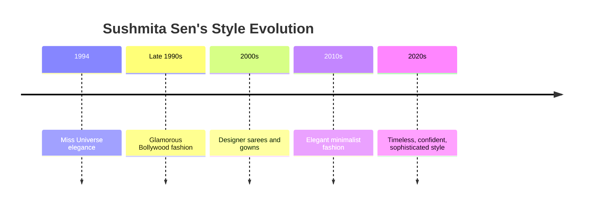
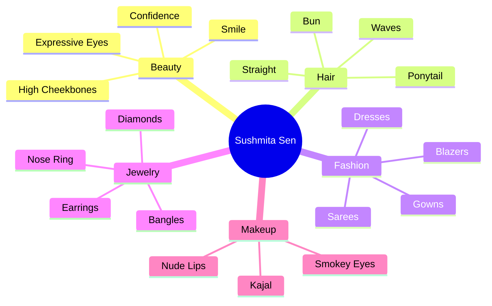

# Sushmita Sen

**Sushmita Sen** is an Indian actress, model, and beauty queen best known for becoming the **first Indian woman to win the Miss Universe title (1994)**. She is widely admired for her graceful appearance, confident personality, elegant fashion choices, expressive eyes, and timeless beauty.

---

# Basic Information

| Attribute | Details |
|-----------|---------|
| Full Name | Sushmita Sen |
| Nationality | Indian |
| Profession | Actress, Model, Beauty Queen |
| Famous For | Miss Universe 1994 |
| Beauty Style | Elegant, Royal, Confident |
| Fashion Style | Indian, Western, Fusion |

---

# Beauty Characteristics

## Face Shape

- Oval face
- Balanced facial proportions
- High cheekbones

---

## Eyes

- Large expressive eyes
- Dark brown eyes
- Well-defined eyebrows
- Strong eye contact

---

## Smile

- Wide natural smile
- Well-aligned teeth
- Confident facial expressions

---

## Hair

Throughout her career she has worn:

- Long straight hair
- Soft curls
- Layered hairstyles
- Bun hairstyles
- Ponytails
- Open wavy hair

Hair color is generally:

- Dark Brown
- Black

---

## Skin Tone

- Medium warm complexion
- Healthy natural glow
- Minimal makeup in many appearances

---

# Signature Beauty Style

Her overall appearance is often associated with:

- Grace
- Confidence
- Royal elegance
- Simplicity
- Strong personality
- Natural beauty

---

# Fashion Style

## Indian Wear

She is frequently seen wearing:

- Sarees
- Silk sarees
- Designer sarees
- Banarasi sarees
- Chiffon sarees
- Anarkalis
- Lehengas

---

## Western Wear

Examples include:

- Evening gowns
- Cocktail dresses
- Blazers
- Pantsuits
- Maxi dresses
- Casual jeans and tops

---

# Jewelry Style

She usually prefers elegant jewelry rather than excessive accessories.

Examples:

- Diamond earrings
- Pearl jewelry
- Statement necklaces
- Bracelets
- Rings
- Bangles

---

# Sushmita Sen's Nose Ring (Nathuni)

<table>
<tr>
<td align="center">

</td>

<td align="center">

</td>

<td align="center">

</td>

<td align="center">

</td>

</tr>
</table>

---

# Makeup Style

Her makeup generally emphasizes natural elegance.

Common elements include:

- Nude foundation
- Soft contouring
- Smokey eyes
- Brown eye shadow
- Kajal
- Eyeliner
- Mascara
- Nude lipstick
- Red lipstick for formal occasions

---

# Hairstyle Collection

- Straight Hair
- Soft Waves
- Hollywood Curls
- Side Part
- Middle Part
- High Bun
- Low Bun
- Messy Bun
- Ponytail
- Traditional Bridal Bun

---

# Color Palette

She is often seen wearing:

- Black
- White
- Red
- Emerald Green
- Royal Blue
- Gold
- Silver
- Ivory
- Maroon
- Beige

---

# Traditional Appearance

Her traditional styling often includes:

- Silk saree
- Bindi
- Nose ring
- Earrings
- Bangles
- Open hair or bun
- Elegant makeup

---

# Modern Appearance

Modern fashion combinations include:

- Blazer with trousers
- Evening gown
- High heels
- Minimal jewelry
- Luxury handbags
- Sunglasses

---

# Public Image

She is widely recognized for:

- Confidence
- Elegant posture
- Graceful public appearances
- Strong stage presence
- Sophisticated fashion sense
- Timeless beauty

---

# Beauty Tips Often Associated with Her Public Image

Although individual routines may vary over time, her public image emphasizes:

- Confidence
- Good posture
- Healthy lifestyle
- Skincare
- Hydration
- Natural makeup
- Fitness
- Positive attitude

---

# Style Evolution

---

# Signature Fashion Elements

---

# Interesting Facts

- First Indian woman to win the **Miss Universe** title (1994).
- Known for carrying both Indian and Western fashion with confidence.
- Her nose ring looks are especially admired in traditional attire and editorial photoshoots.
- Frequently appears in designer sarees and elegant evening gowns.
- Her style is often described as graceful, confident, and timeless.

---

# Related Topics

- Miss Universe
- Indian Fashion
- Saree Styling
- Traditional Jewelry
- Nose Ring Styles
- Beauty Pageants
- Bollywood Fashion
- Makeup Styles
- Hairstyles
- Personal Grooming

---

# Summary

Sushmita Sen is celebrated for her elegant and confident beauty. Her distinctive features—including expressive eyes, graceful smile, balanced facial structure, and refined fashion choices—have made her a style icon. Whether wearing a classic saree with a delicate nose ring or a contemporary evening gown, her public image emphasizes sophistication, confidence, and timeless elegance.