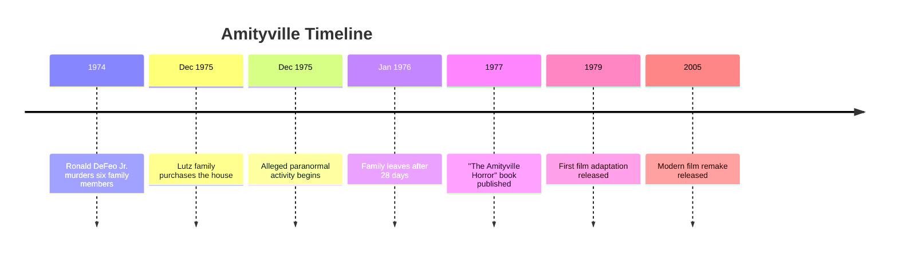
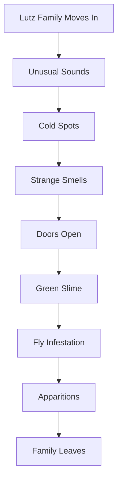

# Amityville Haunting

## Overview

The **Amityville Haunting** is one of the most famous and controversial paranormal cases in modern history. It centers on claims of supernatural events reported by the **Lutz family** after they moved into **112 Ocean Avenue, Amityville, New York**, in December 1975.

The case became internationally famous through books, documentaries, and films. While many paranormal investigators considered it a compelling haunting, numerous journalists, researchers, and legal experts have argued that the haunting claims were exaggerated or fabricated.

Today, the Amityville case is regarded as a landmark in paranormal culture but remains highly disputed.

---

# Basic Information

| Attribute | Details |
|-----------|---------|
| Case Name | Amityville Haunting |
| Location | 112 Ocean Avenue, Amityville, New York, USA |
| Reported Events | December 1975 – January 1976 |
| Main Witnesses | George and Kathy Lutz family |
| Previous Owners | DeFeo Family |
| Type | Alleged Haunted House |
| Status | Unverified and Controversial |

---

# Timeline

---

# Background

## The DeFeo Murders

On **13 November 1974**, **Ronald DeFeo Jr.** murdered six members of his family inside the house.

Victims included:

- Father
- Mother
- Two brothers
- Two sisters

DeFeo was later convicted and sentenced to prison.

The murders are historical facts and are unrelated to whether later paranormal claims are true.

---

# The Lutz Family

The Lutz family moved into the house in December 1975.

Family members:

- George Lutz
- Kathy Lutz
- Three children

They remained in the house for only **28 days** before leaving.

---

# Reported Paranormal Activity

The family claimed to experience numerous unusual events.

Examples include:

- Cold spots
- Strange odors
- Unexplained noises
- Doors opening and closing
- Green slime reportedly appearing on walls
- Swarms of flies during winter
- Invisible forces
- Furniture moving
- Apparitions
- A pig-like entity with glowing eyes nicknamed **"Jodie"**
- George waking around **3:15 AM** each night
- Feelings of oppression
- Religious disturbances

These claims have not been independently verified.

---

# Alleged Events

---

# Investigation

Several paranormal investigators visited the property.

Reported methods included:

- Photography
- Interviews
- Environmental observations

Some investigators reported unusual experiences, while others found no convincing evidence.

---

# Ed and Lorraine Warren

Paranormal investigators **Ed Warren** and **Lorraine Warren** visited the house.

They claimed to experience paranormal phenomena and described the location as haunted.

Their conclusions have been questioned by skeptics and remain controversial.

---

# The Famous Photograph

One famous photograph allegedly shows a child-like figure peering from a doorway.

Possible explanations suggested include:

- Reflection
- Lighting effects
- A member of the investigation team
- Paranormal entity (claimed by some investigators)

No consensus exists regarding the image.

---

# Scientific Perspective

Researchers have proposed several explanations.

Possible factors include:

- Stress
- Suggestion
- Sleep disturbances
- Misinterpretation
- Confirmation bias
- Financial incentives
- Media influence

No scientific investigation has confirmed paranormal activity at the house.

---

# Controversies

Several issues have fueled skepticism.

## Alleged Hoax

Some individuals connected to the case later stated that portions of the haunting story were dramatized.

---

## Legal Disputes

Attorneys involved with the DeFeo case claimed parts of the story were developed during discussions about creating a compelling narrative.

---

## Lack of Physical Evidence

Despite extensive attention:

- No repeatable paranormal evidence has been produced.
- Many reported events rely solely on witness testimony.

---

# Books

The case inspired numerous publications.

Most famous:

- **The Amityville Horror**
- **Murder in Amityville**
- Various investigative books

---

# Film Adaptations

Major films include:

| Year | Film |
|------|------|
| 1979 | The Amityville Horror |
| 1982 | Amityville II: The Possession |
| 1983 | Amityville 3-D |
| 2005 | The Amityville Horror (Remake) |

Many additional films use the "Amityville" name but are fictional stories unrelated to the original case.

---

# Evidence Assessment

| Claim | Scientific Status |
|---------|------------------|
| Cold Spots | Unverified |
| Voices | Unverified |
| Apparitions | Unverified |
| Moving Furniture | Unverified |
| Green Slime | Unverified |
| Pig-like Creature | Unverified |
| Ghosts | No scientific confirmation |

---

# Impact on Popular Culture

The Amityville case influenced:

- Horror films
- Paranormal television
- Ghost hunting
- Haunted house stories
- Modern folklore

It remains one of the best-known alleged haunting cases in the world.

---

# Common Arguments

## Supporters

Supporters argue:

- Multiple witnesses reported unusual events.
- Some investigators believed the haunting was genuine.
- Certain experiences remain unexplained.

---

## Skeptics

Skeptics argue:

- No reproducible evidence exists.
- Financial incentives may have influenced the story.
- Witness testimony alone is insufficient scientific evidence.
- Some accounts changed over time.

---

# Related Cases

- Enfield Poltergeist
- Perron Family Case
- Snedeker House
- Annabelle
- Borley Rectory
- Bell Witch
- Dybbuk Box

---

# Interesting Facts

- The family stayed only **28 days**.
- The address was later changed to reduce unwanted visitors.
- The house has changed owners multiple times.
- Later residents generally did not report the dramatic paranormal events described by the Lutz family.
- The case remains one of the most debated alleged hauntings in paranormal history.

---

# Summary

The **Amityville Haunting** is a famous alleged paranormal case that followed the 1974 DeFeo family murders and the subsequent experiences reported by the Lutz family. Although the story inspired bestselling books and numerous films, extensive debate surrounds its authenticity. To date, no scientific investigation has confirmed that the reported events were caused by paranormal forces, and the case remains a subject of ongoing discussion among paranormal investigators, historians, psychologists, and skeptics.