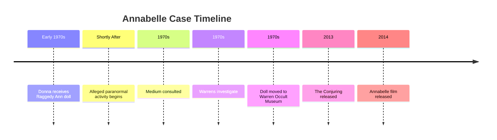

# Annabelle

## Overview

The **Annabelle case** is one of the most famous alleged paranormal investigations in modern history. It centers on a **Raggedy Ann doll** that paranormal investigators **Ed and Lorraine Warren** claimed was associated with unexplained events in the early 1970s.

According to the Warrens, the doll exhibited paranormal activity and was eventually placed in their **Occult Museum** in Connecticut, where it remained enclosed in a specially built glass case.

The Annabelle story inspired books, documentaries, and films in *The Conjuring Universe*. However, many details shown in the movies are fictionalized, and **no scientific evidence has confirmed that the doll possesses supernatural abilities**.

---

# Basic Information

| Attribute | Details |
|-----------|---------|
| Case Name | Annabelle |
| Object | Raggedy Ann Doll |
| Reported Beginning | Early 1970s |
| Main Witnesses | Donna, Angie (reported owners), Lou (friend) |
| Investigators | Ed and Lorraine Warren |
| Location | Connecticut, USA |
| Type | Alleged Haunted Object |
| Status | Unverified and Controversial |

---

# Timeline



---

# Background

According to the commonly told account:

- A nursing student named **Donna** received a Raggedy Ann doll as a gift.
- Donna lived with her roommate **Angie**.
- They allegedly began noticing unusual activity involving the doll.

These events are based on witness accounts and have not been independently verified.

---

# Reported Paranormal Activity

Witnesses claimed the doll:

- Changed position on its own.
- Appeared in different rooms.
- Left handwritten notes.
- Was associated with strange sounds.
- Was connected with disturbing dreams.
- Appeared to move without anyone touching it.

The reports remain anecdotal.

---

# Alleged Sequence of Events

```mermaid
flowchart TD

A[Donna Receives Doll]
    --> B[Doll Appears to Move]

B --> C[Notes Found]

C --> D[Medium Consulted]

D --> E[Spirit Named "Annabelle"]

E --> F[Warrens Investigate]

F --> G[Doll Placed in Glass Case]
```

---

# The Medium's Story

According to the account:

A medium claimed the doll was inhabited by the spirit of a young girl named **Annabelle Higgins**, who had supposedly died near the property.

The Warrens disagreed with this interpretation. They argued that the apparent "spirit" was instead a deceptive inhuman entity pretending to be a child in order to gain the occupants' trust.

This interpretation reflects the Warrens' beliefs and has not been scientifically verified.

---

# Ed and Lorraine Warren

The Warrens investigated the case and concluded:

- The doll should not be kept in a home.
- It was allegedly associated with dangerous paranormal activity.
- It was placed inside a locked display case marked:

> **"WARNING: Positively Do Not Open."**

The warning reflects the Warrens' conclusions rather than established scientific evidence.

---

# The Warren Occult Museum

The doll was displayed for many years in the Warrens' Occult Museum in Monroe, Connecticut.

Visitors reported stories about:

- Bad luck
- Accidents
- Feelings of unease

These accounts are anecdotal and remain unverified.

---

# Scientific Perspective

Researchers and skeptics propose natural explanations for reported experiences, including:

- Suggestion
- Confirmation bias
- Memory distortion
- Coincidence
- Misinterpretation of ordinary events
- Psychological expectation

No controlled scientific investigation has demonstrated that the doll exhibits supernatural behavior.

---

# Film Adaptations

The real Raggedy Ann doll differs significantly from the movie version.

## The Real Doll

- Raggedy Ann doll
- Cloth body
- Yarn hair
- Small size

## Movie Version

- Porcelain-style doll
- Horror-themed appearance
- Original design created for the films

The cinematic appearance was intentionally changed to create a more frightening visual effect.

---

# Movies

| Year | Film |
|------|------|
| 2013 | The Conjuring |
| 2014 | Annabelle |
| 2017 | Annabelle: Creation |
| 2019 | Annabelle Comes Home |

These films are inspired by the reported case but include many fictional events and characters.

---

# Evidence Assessment

| Claim | Scientific Status |
|---------|------------------|
| Doll Moved Alone | Unverified |
| Handwritten Notes | Unverified |
| Spirit Communication | Unverified |
| Demonic Presence | No scientific confirmation |
| Curses | Unverified |
| Paranormal Attacks | Unverified |

---

# Cultural Impact

The Annabelle case became one of the world's best-known alleged haunted-object stories.

It has influenced:

- Horror films
- Television
- Ghost hunting culture
- Paranormal museums
- Popular folklore

---

# Common Arguments

## Supporters

Supporters argue:

- Multiple witnesses described unusual events.
- The Warrens believed the case was genuine.
- Similar stories exist about allegedly haunted objects in various cultures.

---

## Skeptics

Skeptics argue:

- No reproducible evidence exists.
- The claims rely primarily on eyewitness testimony.
- Many reported events can have psychological or environmental explanations.
- Commercial success may have encouraged sensational storytelling.

---

# Common Misconceptions

## "The real Annabelle looks like the movie doll."

False.

The real object associated with the case is a **Raggedy Ann doll**, not the porcelain-style doll seen in the films.

---

## "The movies accurately depict the investigation."

False.

The films take significant creative liberties for dramatic effect.

---

## "The doll has been scientifically proven to be haunted."

False.

There is no scientific consensus or verified evidence that the doll possesses paranormal properties.

---

# Interesting Facts

- The movie version of Annabelle was redesigned because filmmakers felt a Raggedy Ann doll would not appear frightening enough on screen.
- The real doll became one of the most recognized artifacts associated with the Warrens.
- The warning label on the display case contributed to the doll's reputation in popular culture.
- The case remains one of the most frequently discussed alleged haunted-object stories despite the lack of scientific confirmation.

---

# Related Cases

- Amityville Haunting
- Perron Family Case
- Enfield Poltergeist
- Snedeker House
- Dybbuk Box
- Borley Rectory
- Bell Witch

---

# Summary

The **Annabelle case** centers on a Raggedy Ann doll that Ed and Lorraine Warren believed was associated with paranormal activity in the early 1970s. According to witness reports, the doll moved on its own, left written messages, and was linked to disturbing experiences. The Warrens concluded that the activity involved a deceptive supernatural entity and secured the doll in their Occult Museum. Although the case inspired a highly successful film series, the dramatic events shown on screen are largely fictional, and no scientific investigation has confirmed paranormal activity associated with the doll.